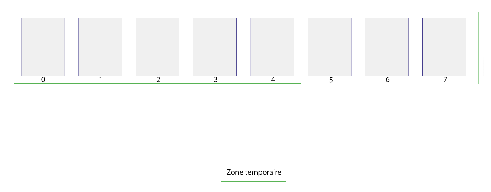

# Activité préliminaire sur les tris

L'objectif de cette activité est de déterminer une stratégie **claire** et **précise** permettant, à partir d'une suite de cartes arbitrairement choisies, d’obtenir une suite de cartes triées **dans l'ordre croissant** suivant leur valeur faciale à la fin du processus.

On ne se souciera ici que des **valeurs** des cartes et non de leurs **couleurs**.

Voici l'**ordre** des valeurs des cartes, de la **moins forte** à la **plus forte**, que l'on utilisera :

*Note* : Si la carte *Joker* existe dans votre jeu, on considèrera qu'elle est plus forte que toutes les autres cartes.

## Partie 1 : Expérimentation

La zone de jeu est constituée :

- d'une **suite de 8 cartes** auxquelles sont associées un **indice de 0 à 7**,
- d'une **zone temporaire** dans laquelle on peut stocker l'**indice ou la valeur** d'une carte.

<figure markdown>
  
  <figcaption>Zone de jeu</figcaption>
</figure>

!!! note "À faire"
    Par groupes de **2 à 3** personnes, vous devez :

    - Disposer une suite de **8 cartes** arbitrairement choisies sur votre table.
    - Établir, à l'écrit, une **suite d'instructions** « en français » permettant de trier ces cartes dans l'ordre croissant. Votre stratégie doit pouvoir être reproduite sur **n'importe quelle suite de cartes**. Vous l'écrirez sur un bloc-note [https://collab.infoforall.fr/](https://collab.infoforall.fr/){ target="_blank" }.
    - Tester votre stratégie sur différentes suites de cartes et vous assurer qu'elle fonctionne toujours.

!!! warning "Important"
    Les **seules opérations élémentaires autorisées** sont les suivantes :

    - **comparer** les valeurs **de deux cartes**,
    - **permuter** (échanger) **deux cartes**,
    - **copier l'indice** ou la **valeur d'une carte** de la suite dans la **zone temporaire** (et inversement),
    - vous pouvez utiliser des **conditions** (*SI ...*, *SINON*) et des **boucles** (*TANT QUE*, *POUR ... ALLANT DE ... A ...*).

    Voici également quelques **règles** à respecter :

    - vous ne pouvez parcourir les cartes que de la **gauche vers la droite** (on ne revient pas en arrière),
    - si une tâche est répétitive, vous pouvez **la nommer** (créer un autre bloc d'instructions qui sera utilisé dans le bloc principal),
    - votre stratégie doit être suffisamment claire, mais vous n'avez pas obligation d'écrire un algorithme formel.

## Partie 2 : Bilan des stratégies

Afin de s'assurer de la clarté de chaque stratégie, chaque groupe tentera à présent de trier une **suite de 8 cartes** arbitrairement choisies en utilisant les **stratégies proposées par les autres groupes**.

!!! note "À faire"
    Par groupes de **2 à 3** personnes, vous devez :

    - Dérouler les instructions proposées par les autres groupes sur des **suites de 8 cartes** choisies **arbitrairement**.
    - Indiquer quelles sont les stratégies qui fonctionnent, et celles qui ne fonctionnent pas.

## Partie 3 : Tri par sélection

??? abstract "Principe du tri par sélection"

    Le **tri par sélection** se déroule comme suit :

    1. Chercher l'**indice** de la **plus faible carte** de la suite (à partir de l'indice **0**) et **échanger** cette carte avec celle qui est placée en **premier**. La première carte est maintenant **la plus faible**.
    2. Chercher l'**indice** de la **plus faible carte** de la suite en partant du **2ème élément** (indice **1**) et **échanger** cette carte avec celle qui est placée en **deuxième**. Les **deux premières cartes** sont les plus faibles et sont maintenant **triées**.
    3. Poursuivre ainsi jusqu’à l’**avant dernière carte** de la liste.

    *Note* : Si la valeur la plus faible des cartes de la suite est associée à plusieurs cartes, on considèrera que la **plus faible carte** est la première (en parcourant de **gauche** à **droite**) ayant cette valeur.

!!! note "À faire 1"
    Dérouler la méthode de **tri par sélection** décrite ci-dessus, **avec une approche humaine** d'abord, sur une **suites de 8 cartes** arbitrairement choisies afin de vérifier son bon fonctionnement.

On a ici expérimenté la méthode de **tri par sélection** avec une **approche humaine**, c'est-à-dire que vous avez utilisé votre *cerveau* pour déterminer facilement, à chaque étape, la **carte la plus faible** de la suite.

Toutefois, en raisonnant avec une démarche plus proche de la **machine**, la recherche de la **carte la plus faible** doit se décomposer en opérations élémentaires, incluant notamment des **affectations**, des **comparaisons** et des **conditions**.

??? abstract "Recherche de **la plus faible carte**"

    Pour rechercher la **plus faible carte** de la **suite de cartes** à partir d'un indice $i$ donné :

    1. Stocker l'**indice** $i$ dans la **zone temporaire**.
    2. En parcourant la **suite de cartes** de **gauche** à **droite**, à partir de l'indice $i + 1$ et jusqu'au bout de la suite :
        - Comparer les **valeurs** de **chaque carte de la suite** avec la **valeur** de la carte dont l'**indice** est stocké dans la **zone temporaire**.
        - `SI` une **carte de la suite** a une valeur **strictement inférieure** à la **valeur de la carte** dont l'**indice** est stocké dans la **zone temporaire**, remplacer l'ancien indice stocké dans la **zone temporaire** par l'**indice de cette carte**.
    3. `Renvoyer` enfin l'**indice** contenu dans la **zone temporaire**.

!!! note "À faire 2"
    Vous devez à présent :

    - Dérouler de nouveau la méthode de **tri par sélection**, en décomposant la **recherche de la carte la plus faible** comme décrit ci-dessus, sur **plusieurs suites de 8 cartes** arbitrairement choisies.
    - Calculer, pour chaque suite de cartes, le **nombre total** de **comparaisons de deux cartes** ayant été effectuées.
    - Que pouvez-vous en dire sur le coût de ce tri ? Est-ce un tri **efficace** ?