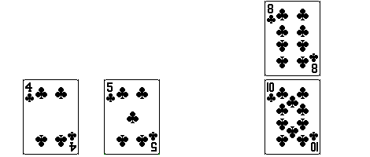

!!! warning "En construction"
    Cette page est actuellement en construction.

# Le tri par insertion

Nous avons vu la méthode de **tri par sélection**, qui a l'avantage d'être facile à appréhender, mais qui s'avère être fortement coûteuse (coût **quadratique** dans **tous les cas**).  
Voyons s'il n'existe pas d'autres algorithmes de tri plus intéressants.

## Présentation du tri

### Avec un jeu de cartes

Le **tri par insertion** est un autre algorithme de tri par **comparaisons**, dont le principe est un peu différent, mais plus "naturel".

Admettons que nous souhaitions trier la suite de cartes suivantes :

<figure markdown>

{ width="80%" }
<figcaption>Une suite de 4 cartes.</figcaption>

</figure>

On utilisera l'**ordre** suivant (de la carte la plus *faible* à la plus *forte*) :

On remarque que les **3 premières cartes** sont **triées**, mais la dernière (le **8**) ne l'est pas.  
Une méthode "naturelle" pour placer cette carte au bon endroit serait la suivante :

On met de côté la carte de **valeur 8**.

{ width="60%" }

On **décale à droite** toutes les cartes qui précèdent et dont la valeur est **supérieure** à celle de la carte que l'on cherche à trier. Ici, il n'y a que le **10** à décaler.

{ width="60%" }

{ width="60%" }

Puis on replace la carte de valeur **8** (mise de côté) à sa bonne position.

{ width="60%" }

{ width="60%" }

Les **4 cartes** de la suite sont maintenant **triées**.

!!! note "A vous de jouer"
    On rajoute une nouvelle carte, de valeur **6**, à la fin de cette suite de cartes. Comment allez-vous procéder pour la replacer à sa bonne position ?

### Une petite animation

## L'algorithme

...
