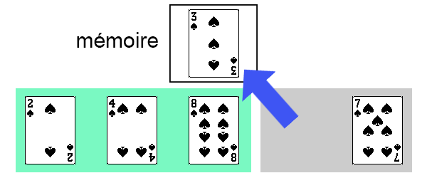

# Le tri par insertion

Nous avons vu la méthode de **tri par sélection**, qui a l'avantage d'être facile à appréhender, mais qui s'avère être fortement coûteuse (coût **quadratique** dans **tous les cas**).  
Voyons s'il n'existe pas d'autres algorithmes de tri plus intéressants.

## Présentation du tri par insertion

### Avec un jeu de cartes

Le **tri par insertion** est un autre algorithme de tri par **comparaisons**, dont le principe est un peu différent, mais plus "naturel".

Dans cette partie, on verra comment trier une **suite de cartes** en utilisant la méthode de **tri par insertion**. On utilisera l'**ordre** suivant (de la carte la plus *faible* à la plus *forte*) :

*Note* : Si vous avez une carte *Joker* dans votre jeu, on considèrera qu'elle est plus forte que toutes les autres cartes.

!!! success "Activité préliminaire"
    Munissez-vous d'un paquet de carte, **mélangez-le**, et placez-le en **face cachée**.  
    Vous disposez d'une **zone de jeu** dans laquelle vous ajouterez les cartes **une par une**, de manière à **toujours** avoir une **suite de cartes triée**.  
    L'objectif est de **trier les 7 premières cartes** du paquet.

    - Prenez la **première carte** du paquet et posez-la (face visible) dans votre zone de jeu.  
    La suite de cartes de votre zone de jeu (composée pour le moment d'une seule carte) est-elle triée ?
    - Prenez la **deuxième carte** du paquet, et intégrez-la à votre **suite de cartes** de manière à ce que celle-ci **reste triée**.
    - Prenez la **troisième carte** du paquet et faites de même. Répétez cela jusqu'à avoir une **suite** de **7 cartes triées** dans votre zone de jeu.

    **Question** : **Décrivez la méthode** que vous avez suivi pour intégrer chaque nouvelle carte à votre suite de cartes triée.

---

Voici le **déroulement** de la **méthode de tri par insertion** sur une **suite de cartes**.  
On souhaite trier la suite de cartes suivantes :

<figure markdown>

{ width="80%" }
<figcaption>Une suite de 5 cartes.</figcaption>

</figure>

!!! info "Composition du tableau"
    On distingue **deux parties** dans le tableau :

    - une **partie triée** (en vert), initialement composée **de la première carte**.
    - une **partie non-triée** (en gris), initialement composée du **reste des cartes**.

    On dispose également d'une **zone mémoire** dans laquelle peut **placer une carte temporairement**.

{ width="60%" }

On commence donc par traiter la **deuxième carte du tableau**, qui est la **première carte** de la **partie non-triée**. On place cette carte dans la zone **mémoire**.

{ width="60%" }

Ensuite, on procède comme suit :

!!! tip "Placer la carte à sa bonne position"
    - En partant de la carte positionnée **juste à gauche** de celle que l'on cherche à trier (c'est-à-dire la dernière carte de la **partie triée** du tableau), et en allant jusqu'à la **première carte** du tableau :
        - On **décale d'une position à droite chaque carte** dont la **valeur** est **strictement supérieure** à la carte que l'on cherche à replacer.
        - On s'arrête **uniquement** si la **carte** n'a **pas** une valeur **supérieure**, ou si l'on a parcouru **toutes les cartes**.
    - On **replace** la **carte** (actuellement en *mémoire*) à **sa bonne position**.

Ici, la carte qui précède celle à replacer (qui se trouve en mémoire) est **inférieure** à la carte à replacer. Cela signifie que notre carte est **déjà à sa bonne position**.

Il n'y a donc **pas de décalage à faire**, et on **replace** la **carte** à sa **position initiale**.

{ width="60%" }

La **partie triée** de notre tableau est maintenant composée des **deux premières cartes**.

{ width="60%" }

On fait de même avec la **troisième carte** du tableau (première carte de la **partie non-triée**).

{ width="60%" }

Ici encore, la carte était déjà à sa bonne position.

{ width="60%" }

On a maintenant **3 cartes** dans la **partie triée** du tableau.  
On met la **quatrième carte** (de *valeur 3*) en **mémoire**.

{ width="60%" }

On constate que les **deux cartes précédentes** (de *valeurs 8* et *4*) ont une valeur **supérieure** à celle de la carte que l'on souhaite trier. Il faut donc **déplacer à droite** ces deux cartes.

{ width="60%" }

{ width="60%" }

On peut maintenant **repositionner** notre carte.

{ width="60%" }

{ width="60%" }

Il ne reste ainsi **plus qu'une seule carte** dans la **partie non-triée** de notre tableau.

On répète le même principe, on place cette **carte** en **mémoire**.

{ width="60%" }

Ici, il n'y a que la **carte précédente** à déplacer.

{ width="60%" }

Puis on repositionne notre carte.

{ width="60%" }

Et voilà, on vient de **trier** une **suite de 5 cartes** par la **méthode de tri par insertion** !

!!! note "À vous de jouer"
    Disposez une **suite de 7 cartes** choisies **au hasard** dans un paquet de cartes.  
    Votre **zone de jeu** est composée de votre **suite de cartes** et d'un **emplacement mémoire**.  
    Effectuez le tri de votre suite de cartes en utilisant la méthode de **tri par insertion** présentée ci-dessus.

### Trier un tableau

On a donc vu que la méthode de **tri par insertion** avait l'avantage d'être assez **naturelle**, raison pour laquelle elle est souvent utilisée pour trier des **cartes à jouer**.

Appliquons à présent ce **tri** sur des **tableaux d'entiers**.

On rappelle le **principe** du **tri par insertion** :

- on fait comme si les **éléments** de la **partie non-triée** du tableau étaient donnés **un par un**, le **premier élément du tableau** constituant, **à lui seul**, un **tableau triée** de *longueur 1*,
- on y **range** ensuite le **deuxième élément du tableau** pour constituer un **tableau trié** de *longueur 2*,
- puis on y range le **troisième élément** pour obtenir un **tableau trié** *longueur 3*,
- et ainsi de suite jusqu’à avoir traité le dernier élément...

On insère donc à la **nième itération** le **nième élément** à sa **bonne position** en décalant à droite tous les éléments de la **partie triée** du tableau qui lui sont supérieurs.

!!! note "Exercice - Trier un tableau"
    <figure markdown>
    

    
    <figcaption>Source : [http://fractale.gecif.net/nsi/pdf/cours/algorithmes/algo_tri.pdf](http://fractale.gecif.net/nsi/pdf/cours/algorithmes/algo_tri.pdf){ target="_blank" }</figcaption>
    

    </figure>
    

## L'algorithme

### Présentation de l'algorithme

!!! info "Note"
    Dans la partie précédente, on a souvent parlé de "déplacements" de cartes. En machine, ces déplacements seront implémentés sous la forme de **copies d'éléments**, en réalisant des affectations.

!!! abstract "Algorithme de recherche du minimum"
    **ALGORITHME** : tri_insertion  
    **ENTRÉES** :  
    &nbsp;&nbsp;&nbsp;&nbsp;`tableau` : un **tableau** d'éléments
    **SORTIE** : aucune (tri en place)

    **DÉBUT**  
    &emsp;&emsp;**POUR** i **ALLANT DE** 1 **À** longueur(tableau) - 1  
    &emsp;&emsp;&emsp;&emsp;valeur_courante ← tableau[i]  
    &emsp;&emsp;&emsp;&emsp;j ← i - 1  
    &emsp;&emsp;&emsp;**SI** tableau[i] < tableau[indice_min], **ALORS**  
    &emsp;&emsp;&emsp;&emsp;indice_min ← i  
    &emsp;&emsp;**FIN POUR**  
    &emsp;&emsp;Renvoyer indice_min  
    **FIN ALGORITHME**

!!! info "Tri stable"
    Le **tri par insertion** est dit "**stable**" car, en cas de **valeurs identiques** dans le tableau initial, leur **ordre** relatif n’est **pas modifié**.

### Une petite animation

!!! success "Simulation du tri par insertion"
    En vert : éléments déjà triés 
    En gris : éléments à trier
    

        

            <ul id="array-trii"></ul>
        

        

            <label for="memory-value">Espace mémoire:</label>
            <input id="memory-value" type="text" readonly>
        

        

            <button id="start-sort" class="md-button">Lancer le tri</button>
            <button id="step-sort" class="md-button">Pas à pas</button>
        
        
    

## Implémentation en Python

...