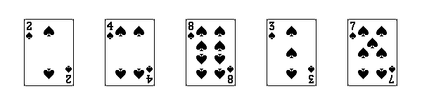
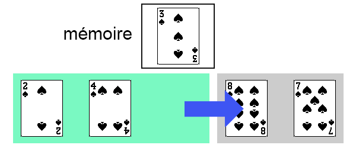

# Le tri par insertion

Nous avons vu la méthode de **tri par sélection**, qui a l'avantage d'être facile à appréhender, mais qui s'avère être fortement coûteuse (coût **quadratique** dans **tous les cas**).  
Voyons s'il n'existe pas d'autres algorithmes de tri plus intéressants.

## Présentation du tri par insertion

### Avec un jeu de cartes

Le **tri par insertion** est un autre algorithme de tri par **comparaisons**, dont le principe est un peu différent, mais plus "naturel".

Dans cette partie, on verra comment trier une **suite de cartes** en utilisant la méthode de **tri par insertion**. On utilisera l'**ordre** suivant (de la carte la plus *faible* à la plus *forte*) :


*Note* : Si vous avez une carte *Joker* dans votre jeu, on considèrera qu'elle est plus forte que toutes les autres cartes.

!!! success "Activité préliminaire"
    Munissez-vous d'un paquet de carte, **mélangez-le**, et placez-le en **face cachée**.  
    Vous disposez d'une **zone de jeu** dans laquelle vous ajouterez les cartes **une par une**, de manière à **toujours** avoir une **suite de cartes triée**.  
    L'objectif est de **trier les 7 premières cartes** du paquet.

    - Prenez la **première carte** du paquet et posez-la (face visible) dans votre zone de jeu.  
    La suite de cartes de votre zone de jeu (composée pour le moment d'une seule carte) est-elle triée ?
    - Prenez la **deuxième carte** du paquet, et intégrez-la à votre **suite de cartes** de manière à ce que celle-ci **reste triée**.
    - Prenez la **troisième carte** du paquet et faites de même. Répétez cela jusqu'à avoir une **suite** de **7 cartes triées** dans votre zone de jeu.

    **Question** : **Décrivez la méthode** que vous avez suivi pour intégrer chaque nouvelle carte à votre suite de cartes triée.

---

Voici le **déroulement** de la **méthode de tri par insertion** sur une **suite de cartes**.  
On souhaite trier la suite de cartes suivantes :

<figure markdown>
<center>
{ width="80%" }
<figcaption>Une suite de 5 cartes.</figcaption>
</center>
</figure>

!!! info "Composition du tableau"
    On distingue **deux parties** dans le tableau :

    - une **partie triée** (en <span style="color:green">vert</span>), initialement composée **de la première carte**.
    - une **partie non-triée** (en <span style="color:gray">gris</span>), initialement composée du **reste des cartes**.

    On dispose également d'une **zone mémoire** dans laquelle peut **placer une carte temporairement**.

<center>
{ width="60%" }
</center>

On commence donc par traiter la **deuxième carte du tableau**, qui est la **première carte** de la **partie non-triée**. On place cette carte dans la zone **mémoire**.

<center>
{ width="60%" }
</center>

Ensuite, on procède comme suit :

!!! tip "Placer la carte à sa bonne position"
    - En partant de la carte positionnée **juste à gauche** de celle que l'on cherche à trier (c'est-à-dire la dernière carte de la **partie triée** du tableau), et en allant jusqu'à la **première carte** du tableau :
        - On **décale d'une position à droite chaque carte** dont la **valeur** est **strictement supérieure** à la carte que l'on cherche à replacer.
        - On s'arrête **uniquement** si la **carte** n'a **pas** une valeur **supérieure**, ou si l'on a parcouru **toutes les cartes**.
    - On **replace** la **carte** (actuellement en *mémoire*) à **sa bonne position**.

Ici, la carte qui précède celle à replacer (qui se trouve en mémoire) est **inférieure** à la carte à replacer. Cela signifie que notre carte est **déjà à sa bonne position**.

Il n'y a donc **pas de décalage à faire**, et on **replace** la **carte** à sa **position initiale**.

<center>
{ width="60%" }
</center>

La **partie triée** de notre tableau est maintenant composée des **deux premières cartes**.

<center>
{ width="60%" }
</center>

On fait de même avec la **troisième carte** du tableau (première carte de la **partie non-triée**).

<center>
{ width="60%" }
</center>

Ici encore, la carte était déjà à sa bonne position.

<center>
{ width="60%" }
</center>

On a maintenant **3 cartes** dans la **partie triée** du tableau.  
On met la **quatrième carte** (de *valeur 3*) en **mémoire**.

<center>
{ width="60%" }
</center>

On constate que les **deux cartes précédentes** (de *valeurs 8* et *4*) ont une valeur **supérieure** à celle de la carte que l'on souhaite trier. Il faut donc **déplacer à droite** ces deux cartes.

<center>
{ width="60%" }
</center>

<center>
{ width="60%" }
</center>

On peut maintenant **repositionner** notre carte.

<center>
{ width="60%" }
</center>

<center>
{ width="60%" }
</center>

Il ne reste ainsi **plus qu'une seule carte** dans la **partie non-triée** de notre tableau.

On répète le même principe, on place cette **carte** en **mémoire**.

<center>
{ width="60%" }
</center>

Ici, il n'y a que la **carte précédente** à déplacer.

<center>
{ width="60%" }
</center>

Puis on repositionne notre carte.

<center>
{ width="60%" }
</center>

Et voilà, on vient de **trier** une **suite de 5 cartes** par la **méthode de tri par insertion** !

!!! note "À vous de jouer"
    Disposez une **suite de 7 cartes** choisies **au hasard** dans un paquet de cartes.  
    Votre **zone de jeu** est composée de votre **suite de cartes** et d'un **emplacement mémoire**.  
    Effectuez le tri de votre suite de cartes en utilisant la méthode de **tri par insertion** présentée ci-dessus.

### Trier un tableau

On a donc vu que la méthode de **tri par insertion** avait l'avantage d'être assez **naturelle**, raison pour laquelle elle est souvent utilisée pour trier des **cartes à jouer**.

Appliquons à présent ce **tri** sur des **tableaux d'entiers**.

On rappelle le **principe** du **tri par insertion** :

- on fait comme si les **éléments** de la **partie non-triée** du tableau étaient donnés **un par un**, le **premier élément du tableau** constituant, **à lui seul**, un **tableau triée** de *longueur 1*,
- on y **range** ensuite le **deuxième élément du tableau** pour constituer un **tableau trié** de *longueur 2*,
- puis on y range le **troisième élément** pour obtenir un **tableau trié** *longueur 3*,
- et ainsi de suite jusqu’à avoir traité le dernier élément...

On insère donc à la **n<sup>ième</sup> itération** le **n<sup>ième</sup> élément** à sa **bonne position** en décalant à droite tous les éléments de la **partie triée** du tableau qui lui sont supérieurs.

!!! note "Exercice - Trier un tableau"

    On souhaite trier le tableau suivant avec le **tri par insertion** : `[5, 3, 1, 4, 6, 2]`.  
    Indiquez quel est l'**état du tableau** après chaque **insertion d'élément**.

    <figure markdown>
    <center>
    
    <figcaption>Source : [http://fractale.gecif.net/nsi/pdf/cours/algorithmes/algo_tri.pdf](http://fractale.gecif.net/nsi/pdf/cours/algorithmes/algo_tri.pdf){ target="_blank" }</figcaption>
    </center>
    </figure>

    Faites de même avec le tableau `[2,8,1,5,2,3]`.
    

## L'algorithme

### Présentation de l'algorithme

!!! info "Note"
    Dans la partie précédente, on a souvent parlé de "déplacements" de cartes. En machine, ces déplacements seront implémentés sous la forme de **copies d'éléments**, en réalisant des affectations.

!!! abstract "Algorithme du tri par insertion"
    <div style="font-size:1.1em">
    **ALGORITHME** : tri_insertion  
    **ENTRÉE** :  
    &emsp;&emsp;`tableau` : un **tableau** d'éléments  
    **SORTIE** : aucune (tri en place)

    **DÉBUT**  
    &emsp;&emsp;**POUR** i **ALLANT DE** 1 **À** longueur(tableau) - 1  
    &emsp;&emsp;&emsp;&emsp;cle ← tableau[i]  
    &emsp;&emsp;&emsp;&emsp;j ← i $-$ 1  
    &emsp;&emsp;&emsp;&emsp;**TANT QUE** j ≥ 0 **ET QUE** tableau[j] > cle  
    &emsp;&emsp;&emsp;&emsp;&emsp;&emsp;tableau[j + 1] ← tableau[j]  
    &emsp;&emsp;&emsp;&emsp;&emsp;&emsp;j ← j $-$ 1  
    &emsp;&emsp;&emsp;&emsp;**FIN TANT QUE**  
    &emsp;&emsp;&emsp;&emsp;tableau[j + 1] ← cle  
    &emsp;&emsp;**FIN POUR**  
    &emsp;&emsp;Renvoyer **∅**  
    **FIN ALGORITHME**
    </div>

!!! note "Exercice 1"
    **Déroulez** l'algorithme sur le tableau `[5, 3, 1, 4, 6, 2]`.

!!! note "Exercice 2"
    1. Pourquoi commence t-on la boucle **POUR** à partir de **1** ?
    2. **Expliquez** à quoi sert la 3<sup>ème</sup> **ligne** de l'**algorithme** : `j ← i - 1`.
    3. Dans le **TANT QUE**, à quoi sert la première condition `j ≥ 0` ? La deuxième condition `tableau[j] > cle` ? Pourrait t-on inverser les deux conditions ?
    4. À quoi sert la ligne `tableau[j + 1] ← tableau[j] ` dans le **TANT QUE** ?
    5. Pourquoi **décrémente t-on** (c'est-à-dire que l'on diminue de 1) la valeur de `j` à chaque tour de la boucle **TANT QUE** ?
    6. Expliquez l'**affectation** `tableau[j + 1] ← cle ` après la boucle **TANT QUE**.

!!! info "Tri stable"
    Le **tri par insertion**, écrit comme ci-dessus, est dit "**stable**" car, en cas de **valeurs identiques** dans le tableau initial, leur **ordre** relatif n’est **pas modifié**.

### Une petite animation

!!! success "Simulation du tri par insertion"
    <span style="color:green">En vert</span> : éléments déjà triés<br />
    <span style="color:#a3a3a3">En gris</span> : éléments à trier
    <div class="container-trii">
        <div class="array-trii-wrapper">
            <ul id="array-trii"></ul>
        </div>
        <div class="memory">
            <label for="memory-value">Espace mémoire:</label>
            <input id="memory-value" type="text" readonly>
        </div>
        <div class="buttons-trii">
            <button id="start-sort" class="md-button">Lancer le tri</button>
            <button id="step-sort" class="md-button">Pas à pas</button>
        </div>        
    </div>

## Implémentation en Python

Maintenant que l'on a déterminé l'**algorithme** du **tri par insertion**, on peut l'**implémenter en Python**.

**Téléchargez** le programme squelette (à compléter) ci-dessous.

!!! success "<span id="fichiers_python">Fichiers Python</span>"
    - [tri_insertion.py](src/tri_insertion.py){ target="_blank" } : programme **Python** avec les fonctions à compléter.
    - (à venir) : programme **Python** corrigé.

!!! tip "Module *doctest*"
    Dans la **docstring** de la fonction `tri_insertion`, des **tests** sont présents. Ces tests sont exécutés par le module natif *doctest*. Lorsque vous **exécutez** le programme, si les tests réussissent, **rien ne se passera**. Sinon, vous obtiendrez des informations sur les tests qui ont échoué.

    La fonction `testmod` (qui exécute les **tests**) est appelée dans la **dernière ligne** du programme. Pour obtenir davantage d'informations sur les erreurs liées aux tests, vous pouvez activer le mode *verbeux* en remplaçant le paramètre `verbose=False` par `verbose=True`.

!!! note "Exercice préliminaire"
    Dans les **tests** présents dans la docstring de la fonction `tri_insertion`, la première instruction est la suivante :  
    `>>> l = [randint(0, 99) for _ in range(10)]`  
    **Expliquez** ce que fait cette instruction.

!!! note "Exercice 1"
    **Écrivez** la fonction `tri_insertion`. Exécutez le programme pour vous assurer que votre fonction soit correcte (il ne doit rien se passer).

!!! note "Exercice 2"
    **Écrivez** la fonction `tri_insertion_decroissant` permettant de **trier un tableau dans l'ordre décroissant**. Que faut-il changer par rapport à la fonction `tri_insertion` ?

## Coût de l'algorithme

Comme pour le tri par sélection, on analysera le **coût algorithmique** du **tri par insertion** en comptant le **nombre de comparaisons** effectuées entre deux éléments du tableau.

!!! success "<span id="fichiers_python">Fichier Python</span>"
    - [tri_insertion_comp.py](src/tri_insertion_comp.py){ target="_blank" } : programme **Python** permettant de visualiser le déroulement du tri et le nombre de comparaisons effectuées.

    Vous n'avez pas besoin de modifier ce fichier en dehors du contenu des deux **variables globales** :

    - `TABLEAU` : Tableau donné en **entrée** à la fonction effectuant le **tri par insertion**.
    - `MODE_SLEEP` : Permet d'activer le mode "pas à pas". En activant ce mode, vous devrez appuyer sur la touche "Entrer" lorsque demandé afin de passer à l'étape suivante. Affectez la variable à `True` activer ce mode, ou à `False` sinon.

!!! note "Exercice 1"
    Téléchargez le **fichier Python** ci-dessus.

    1. Exécutez ce programme avec un **tableau** de **5 éléments triés dans l'ordre décroissant**. Combien y a t-il de comparaisons :
        - à la **première** itération ($i = 1$) ?
        - à la **deuxième** itération ($i = 2$) ?
        - à la **troisième** itération ($i = 3$) ?
        - à la **quatrième** itération ($i = 4$) ?
        - au **total** ?
    2. Faites la même chose que précédemment avec un **tableau** de **5 éléments triés dans l'ordre croissant**.
    3. Selon vous, quel est le **meilleur des cas** et le **pire des cas** concernant le tableau donné en entrée de la fonction de **tri par insertion** ?

!!! tip "Rappel sur les complexités"
    Voici un rappel sur les différentes complexités :
    
    - Logarithmique $Θ(log~n)$ : la complexité évolue **moins vite** que le nombre **n** de données (par exemple : si on multiplie le nombre de données **n** par **2**, on ne rajoute qu'**une seule** opération).
    - Linéaire $Θ(n)$ : la complexité évolue **comme** le nombre **n** de données (par exemple : si on multiplie le nombre de données **n** par **2**, le temps d'exécution est multiplié par **2**).
    - Quasi-linéaire $O(n~log~n)$ : Intermédiaire entre linéaire et quadratique. En pratique, un algorithme de complexité quasi-linéaire a un comportement très proche d’un algorithme de complexité linéaire.
    - Quadratique $Θ(n^2)$ : la complexité évolue **comme le carré** du nombre **n** de données (par exemple : si on multiplie le nombres de données **n** par **2**, le temps d'exécution est multiplié par **4**).
    - Exponentielle $Θ(2^n)$ : la complexité évolue à terme **beaucoup plus vite** que n'importe quelle fonction polynomiale du nombre **n** de données (par exemple : si on multiplie le nombre de données **n** par **100**, le temps d'exécution est multiplié par $2^{100}$, soit **1267650600228229401496703205376**).

    <figure markdown>
    <center>
    
    <figcaption>Courbes d'évolution des différentes complexités algorithmiques.<br />(généré avec [ce programme](src/graphique_complexites.py){ target="_blank" })</figcaption>
    </center>
    </figure>

!!! note "Exercice 2"
    Exécutez le programme avec des **tableaux triés dans l'ordre croissant** de différentes **longueurs**. Pour une longueur $n$ donnée, quel sera le nombre $C(n)$ de **comparaisons** obtenu dans le cas où le **tableau** est **trié dans l'ordre croissant** ?

    En déduire le **coût du tri par insertion** dans le **meilleur des cas** (logarithmique ? linéaire ? quasi-linéaire ? quadratique ? exponentiel ?).

!!! note "Exercice 3"
    Exécutez le programme avec des **tableaux triés dans l'ordre décroissant** :

    - de longueur $5$,
    - de longueur $6$,
    - de longueur $7$.

    On notera le nombre de comparaisons sous la forme $C(n) = C_i(1) + C_i(2) + [...] + C_i(n-2) + C_i(n - 1)$ avec $n$ la **longueur du tableau** et $C_i(i)$ le **nombre de comparaisons** effectuées à l'**itération** $i$.
    
    Pour une longueur $n$ donnée, quel sera donc le nombre $C(n)$ de **comparaisons** obtenu dans le cas où le **tableau** est **trié dans l'ordre décroissant** ?

    En déduire le **coût du tri par insertion** dans le **meilleur des cas** (logarithmique ? linéaire ? quasi-linéaire ? quadratique ? exponentiel ?).

### Terminaison du tri par insertion

Pour démontrer la **terminaison** de notre algorithme, il faut exhiber un **variant de boucle** pour **chacune des boucles** de l'algorithme.

!!! success "Variant de boucle"
    On appelle **variant de boucle** toute **quantité** $v$ (qui peut être déterminée en fonction des différentes **variables** du programme) telle que :

    - $v$ ne prend que des valeurs **entières**,
    - $v$ est initialement **positive**,
    - $v$ **décroit strictement** à chaque passage dans la boucle.
    
    On exhibe un **variant de boucle** pour démontrer qu'une boucle **se termine**, en un temps fini.   
    S'il existe plusieurs boucles dans un programme, il faut trouver autant de variants qu'il y en a.

!!! tip "Prouver la terminaison"
    Concrètement, on peut prouver la **terminaison** d'un algorithme en montrant que les deux propositions suivantes sont **vraies** :

    - Proposition A : les **boucles** peuvent s'exprimer sous la forme **TANT QUE** <span style="color:#23ab32">VARIANT</span> **> 0**
    - Proposition B : le <span style="color:#23ab32">VARIANT</span> est une **suite d'entiers strictement décroissante**.

    Si les deux propositions **A** et **B** sont vraies ($A \land B$), l'algorithme s'arrêtera **toujours**. Autrement (au moins l'une des deux propositions n'est pas vérifiée, $\neg(A \land B)$), il existe au moins un cas où l'algorithme ne se terminera pas.


!!! info "Exemple"
    Démontrons que la boucle **POUR** suivante se termine :

    ```
    POUR i ALLANT DE 10 à 49 AVEC UN PAS DE 5:
        Instructions ne modifiant pas la valeur de i...
    ```

    On peut ré-écrire cette boucle **POUR** avec une boucle **TANT QUE** :

    ```
    i = 10
    TANT QUE i < 50:
        Instructions ne modifiant pas la valeur de i...
        i = i + 5
    ```

    Si on note $n$ le **nombre de tours de boucle** effectué, on peut représenter les valeurs successives que va prendre $i$ sous la forme d'une suite arithmétique :  
    $i_n = i_0 + r*n$, avec $i_0$ la **valeur initiale** de $i_n$ et $r$ la **raison** de la suite.

    Ici, $i_0 = 10$ et $r = 5$.  
    Donc $i_n = 10 + 5n$.

    On peut donc ré-écrire la condition **TANT QUE** de la manière suivante :

    TANT QUE $i_n < 50$  
    TANT QUE $10 + 5n < 50$  
    TANT QUE $0 < 50 - 10 - 5n$  
    TANT QUE $50 - 10 - 5n > 0$  
    TANT QUE $40 - 5n > 0$

    On obtient donc notre **variant** $v_n$ qui prend la forme d'une nouvelle **suite arithmétique** :  
    $v_n = v_0 - r*n$ avec $v_0 = 40$ pour **valeur initiale** et $r = -5$ pour **raison** de la suite.  
    Donc :  
    $v_n = 40 - 5n$ est un **variant de la boucle** car il s'agit d'une suite **d'entiers**, **initialement positive** et qui **décroit strictement** à chaque tour de boucle (car la **raison** est **négative**).

    On a trouvé un **variant**, et donc **démontré la terminaison de notre boucle**.

On rappelle l'algorithme du **tri par insertion** :

!!! abstract "Algorithme du tri par insertion"
    <div style="font-size:1.1em">
    **ALGORITHME** : tri_insertion  
    **ENTRÉE** :  
    &emsp;&emsp;`tableau` : un **tableau** d'éléments  
    **SORTIE** : aucune (tri en place)

    **DÉBUT**  
    &emsp;&emsp;**POUR** i **ALLANT DE** 1 **À** longueur(tableau) - 1  
    &emsp;&emsp;&emsp;&emsp;cle ← tableau[i]  
    &emsp;&emsp;&emsp;&emsp;j ← i $-$ 1  
    &emsp;&emsp;&emsp;&emsp;**TANT QUE** j ≥ 0 **ET QUE** tableau[j] > cle  
    &emsp;&emsp;&emsp;&emsp;&emsp;&emsp;tableau[j + 1] ← tableau[j]  
    &emsp;&emsp;&emsp;&emsp;&emsp;&emsp;j ← j $-$ 1  
    &emsp;&emsp;&emsp;&emsp;**FIN TANT QUE**  
    &emsp;&emsp;&emsp;&emsp;tableau[j + 1] ← cle  
    &emsp;&emsp;**FIN POUR**  
    &emsp;&emsp;Renvoyer **∅**  
    **FIN ALGORITHME**
    </div>

!!! note "Exercice 1"
    Montrer la terminaison de la boucle **TANT QUE**. Il y a deux conditions qui doivent être vérifiées pour pouvoir rentrer dans la boucle. Si une seule des deux conditions ($j ≥ 0$ ou $tableau[j] > cle$) n'est plus vérifiée, alors la boucle s'arrête.

    On ne tiendra compte ici que de la **première condition** : `TANT QUE j ≥ 0`.

!!! note "Exercice 2"
    Enfin, montrer la terminaison de la boucle **POUR** principale de l'algorithme.

### Correction du tri par insertion

Dans les deux parties précédentes, nous avons montré :

- Le **coût algorithmique** de l'algorithme du tri par insertion, qui est **quadratique** dans le **pire des cas**, c'est-à-dire en $O(n^2)$, et qui est **linéaire** dans le **meilleur des cas**, c'est-à-dire en $O(n)$.
- La **terminaison** de l'algorithme. On sait que l'algorithme finira toujours par se terminer.

Il reste toutefois à démontrer que l'algorithme **renvoie toujours un résultat correct**.

On rappelle que la **preuve de correction** d'un algorithme permet d'affirmer :

- qu'il **fournit toujours la bonne réponse**
- sur **toutes les entrées valides** qu'on lui donne (les entrées qui respectent les **préconditions**).

Pour démontrer la correction du **tri par insertion**, il faut déterminer un **invariant de boucle** pour la **boucle principale** de notre algorithme.

!!! tip "Invariant de boucle"
    On appelle **invariant de boucle** une **propriété** $P$ qui est **vraie avant et après chaque itération** de la boucle.

On rappelle que l'on **démontre** un **invariant** en utilisant un **raisonnement par récurrence**.

!!! tip "Démonstration de l'invariant par récurrence"
    Pour montrer à l'aide d'une **récurrence simple** qu'une proposition $P(k)$ est vérifiée pour tout entier $k \ge 0$, avec $k$ le nombre d'itérations de la boucle effectuées :
    
    - **Initialisation** : on vérifie que la proposition est **vraie** au **rang initial** $0$, c'est-à-dire **avant le premier passage** dans la **boucle**.
    - **Conservation** : on suppose que la proposition est **vraie à un certain rang** $k \ge 0$ fixé, c'est-à-dire **après** $k$ **tours de boucle**, et on en déduit qu'elle est **vraie** au **rang suivant** $k + 1$, c'est-à-dire après **un tour de boucle en plus**. On peut écrire $P_k \implies P_{k+1}$.
    - **Terminaison** : on exploite les deux phases précédentes et on montre que la proposition est **vraie** sur **toutes les données** une fois la **dernière itération** de la **boucle** effectuée.

---

Dans la cas du tri par insertion, on peut décomposer le problème en :

- un **sous-tableau trié** à gauche, initialement composé du **premier élément**,
- un **sous-tableau non-trié** à droite.

!!! success "Une proposition d'invariant"
    On propose l'invariant $P_k$ suivant : « Après $k$ tours de boucle, $k+1$ éléments sont triés dans le sous-tableau $[0;k]$ de gauche. »

!!! abstract "Algorithme du tri par insertion"
    <div style="font-size:1.1em">
    **ALGORITHME** : tri_insertion  
    **ENTRÉE** :  
    &emsp;&emsp;`tableau` : un **tableau** d'éléments  
    **SORTIE** : aucune (tri en place)

    **DÉBUT**  
    &emsp;&emsp;**POUR** i **ALLANT DE** 1 **À** longueur(tableau) - 1  
    &emsp;&emsp;&emsp;&emsp;cle ← tableau[i]  
    &emsp;&emsp;&emsp;&emsp;j ← i $-$ 1  
    &emsp;&emsp;&emsp;&emsp;**TANT QUE** j ≥ 0 **ET QUE** tableau[j] > cle  
    &emsp;&emsp;&emsp;&emsp;&emsp;&emsp;tableau[j + 1] ← tableau[j]  
    &emsp;&emsp;&emsp;&emsp;&emsp;&emsp;j ← j $-$ 1  
    &emsp;&emsp;&emsp;&emsp;**FIN TANT QUE**  
    &emsp;&emsp;&emsp;&emsp;tableau[j + 1] ← cle  
    &emsp;&emsp;**FIN POUR**  
    &emsp;&emsp;Renvoyer **∅**  
    **FIN ALGORITHME**
    </div>

!!! note "Exercice 1 : Initialisation"
    Commençons par l'**initialisation**.
    Avant de rentrer dans la boucle ($k=0$), l'**invariant** $P_k$ est-il vérifié ?

??? tip "Réponse 1"
    Avant de rentrer dans la boucle (k=0), notre sous-tableau trié ne contient que la première valeur.
    Or, un sous-tableau ne contenant qu'**un élément** est **trié**.

    $P_k$ correspond à cette proposition :

    « Après $k$ tours de boucle, $k+1$ éléments sont triés dans le sous-tableau $[0;k]$ de gauche. »

    $P_0$ correspond donc à :

    « Après 0 tours de boucle, 1 élément est trié dans le sous-tableau [0;0] de gauche. »

    La propriété $P_0$ est vérifiée, on a terminé la phase d'**initialisation**.

!!! note "Exercice 2"
    Quelle va être la valeur :

    - de $i$ lors du **premier tour de la boucle POUR principale** ?
    - de $j$ avant de rentrer dans le **TANT QUE** lors du premier tour de la boucle principale ?

    Indiquez quelle est la relation entre $k$ et $i$.

!!! note "Exercice 3 : Conservation"
    Démontrons maintenant la **conservation**, c'est-à-dire que $P_k \implies P_{k+1}$.  
    Pour cela, on suppose d'abord **vraie** la proposition $P_k$ : « Après $k$ tours de boucle, $k+1$ éléments sont triés dans le sous-tableau $[0;k]$ de gauche. »  
    Il faut maintenant démontrer que la proposition $P_{k+1}$ est également **vraie**.

    On distinguera pour cela **trois cas** :

    - le cas où la **clé** (d'indice $k+1$) est **inférieure** à tous les éléments du sous-tableau trié $[0;k]$,
    - le cas où la **clé** (d'indice $k+1$) est **supérieure** à tous les éléments du sous-tableau trié $[0;k]$,
    - le cas où la **clé** (d'indice $k+1$) est **inférieure** à certains éléments du sous-tableau trié $[0;k]$, mais pas tous.

??? tip "Réponse 3"
    Au début du tour de boucle $k+1$ :

    - l'indice $i$ est égal à $k+1$,
    - on dispose d'un sous-tableau $[0;k]$ trié auquel on va rajouter un nouvel élément, la clé d'indice $k+1$.

    **Cas 1 : clé (indice $k+1$) inférieure aux éléments de [0;k]** :

    - La boucle **TANT QUE** continue jusqu'à avoir parcouru tous les éléments du sous-tableau trié, car tous les éléments ont une valeur **supérieure** à la **clé**. On **décale** donc tous les éléments du **sous-tableau trié** d'une case vers la **droite**.  
    Les éléments de $[0;k]$ sont à présent dans $[1;k+1]$.
    - L'ordre des éléments est conservé (on les a seulement décalé).
    - Après la dernière itération, $j$ vaut donc $-1$, et la **clé** est **replacée** en position.

    La clé est donc maintenant à l'indice $0$ et est inférieure à tous les éléments du sous-tableau $[1;k+1]$. On peut donc affirmer que le tableau [0;k+1] est maintenant **trié en ordre croissant**.

    Donc $P_{k+1}$ est VRAI.

    **Cas 2 : clé (indice $k+1$) supérieure (ou égale) aux éléments de $[0;k]$**

    - On ne rentre même pas dans le **TANT QUE** puisque l'une de ses conditions n'est pas vérifiée :  
    `TANT QUE j ≥ 0 et que t[j] > cle`
    - On effectue qu'une seule comparaison entre la **clé** et l'**élément qui le précède**. $j$ vaut donc $i-1$ après la boucle **TANT QUE**, et on place la clé avec l'instruction `t[j+1] ← cle`.  
    La **clé** reste au même indice $i$.
    - Le sous-tableau $[0, k]$ était déjà trié dans l'ordre croissant, on ne le change pas.
    - On rajoute la **clé** (un élément plus grand ou égal à tous les autres) à l'indice $k+1$.

    Finalement, on obtient un sous-tableau $[0; k+1]$ **trié** après avoir effectué un tour de boucle supplémentaire de la boucle **POUR** principale.

    Donc $P_{k+1}$ est VRAI.

    **Cas 3 : clé (indice $k+1$) inférieure à certains éléments de $[0;k]$**

    Les éléments du sous-tableau $[0;k]$ sont **triés**, cela signifie que l'on a d'abord une première partie des éléments inférieurs ou égaux à la clé, puis une deuxième partie des éléments supérieurs à la clé.

    - Les éléments d'indice $[m;k]$ sont **supérieurs** à la clé et vont donc être décalés à droite.
    - Les éléments d'indice $[0;m-1]$ sont **inférieurs** ou égaux à la clé et ne vont donc pas bouger.

    On rappelle les conditions du **TANT QUE** :
    `TANT QUE j ≥ 0 et que t[j] > cle`

    - La seconde condition ne sera vraie que jusqu'à t[m] > cle, on déplace donc d'une case à droite les éléments [m; k] qui vont se retrouver en [m+1; k+1]. L'ordre des éléments n'est pas change (puisqu'on les a juste décalé d'un cran vers la droite).
    - Le sous-tableau [0;m-1] ne sera quant à lui pas modifié.
    - A l'issue de la boucle, $j$ contiendra $m-1$. L'instruction permettant de repositionner la **clé** au bon endroit est `t[j+1] ← cle`.  
    Donc la **clé** sera placée à l'indice $m - 1 + 1 = m$.
    - Finalement :
        - Le sous-tableau $[0; m-1]$ est **trié** (pas de changement) et **inférieur ou égal** à la **clé**.
        - La **clé** est à l'indice $m$.
        - Le sous-tableau $[m+1;k+1]$ est **trié** et **supérieur** à la **clé**.

    Le sous-tableau $[0; k+1]$ est donc bien trié après avoir effectué un tour de boucle supplémentaire.

    Donc $P_{k+1}$ est VRAI.

**<u>Terminaison</u>**

Il ne reste plus qu'à vérifier la **terminaison**, c'est-à-dire si l'**invariant** vérifie **toutes les données** du tableau d'entrée.

La boucle **POUR** principale va de **1** à **longueur - 1**.  
L'algorithme aura donc, à la fin, fait **longueur - 1** tours de boucle.

Or l'invariant $P_k$ est la propriété selon laquelle, « Après $k$ tours de boucle, $k+1$ éléments sont triés dans le sous-tableau $[0;k]$ de gauche. »

On avait remarqué la relation suivante entre $i$ et $k$ : $k = i$.

À la fin de l'algorithme, $k$ va donc valoir $longueur-1$.

Le nombre d'éléments triés correctement est donc $k + 1 = longueur-1 + 1 = longueur$ élements triés.

Après le **dernier tour de boucle**, le **sous-tableau trié** contient donc **longueur** éléments triés, c'est-à-dire **tout le tableau**.

La **terminaison** est démontrée : l'algorithme agit bien sur toutes les données.

Finalement, la proposition $P_k$ est bien un **invariant** de la boucle principale de l'algorithme du tri par insertion, et permet de prouver sa correction.