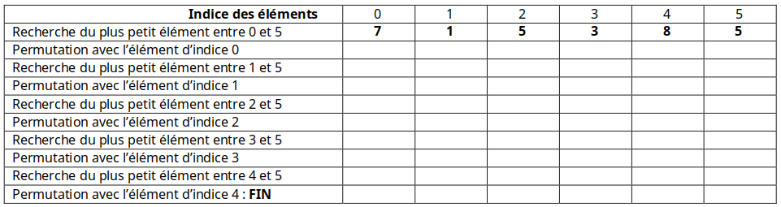

# Le tri par sélection

Le **tri par sélection** (du **minimum** ou du **maximum**) est un algorithme de tri par **comparaisons**.  
Il s'agit d'un algorithme simple mais qui est, comme constaté pendant l'activité préliminaire, **inefficace**.

## Présentation du tri

...

## L'algorithme

L'algorithme du **tri par sélection** peut être écrit de plusieurs manières différentes :

- en **itératif** ou en **récursif**,
- **en place** ou non.

!!! info "Tri en place"
    Un tri est dit *en place* s'il modifie directement la structure qu’il est en train de trier, plutôt que de créer et de renvoyer une nouvelle structure.

L'algorithme présenté ici sera écrit de manière **itérative** et **en place**.  
Le tri s'effectuera par sélection **du minimum**.

Pour simplifier les choses, on commence par séparer l'algorithme de tri en **3 sous-algorithmes** :

- l'algorithme principal `tri_selection(tableau)`,
- l'algorithme `minimum(tableau, debut)` permettant la recherche de l'indice de l'**élément minimal** du tableau à partir de l'indice `debut` donné,
- l'algorithme `echanger(tableau, i, j)` permettant d'échanger **deux éléments** d'indices `i` et `j` donnés.

!!! abstract "Algorithme du tri par sélection"
    **ALGORITHME** : tri_selection  
    **ENTRÉES** :  
    &nbsp;&nbsp;&nbsp;&nbsp;`tableau` : un **tableau** d'éléments pouvant être **comparés**  
    **SORTIE** : aucune (tri *en place*)

    **DÉBUT**  
    &emsp;&emsp;n ← longueur(tableau)  
    &emsp;&emsp;**POUR** debut **ALLANT DE** 0 **À** n - 2  
    &emsp;&emsp;&emsp;&emsp;indice_min ← minimum(tableau, debut)  
    &emsp;&emsp;&emsp;&emsp;**SI** indice_min **≠** debut, **ALORS**  
    &emsp;&emsp;&emsp;&emsp;&emsp;&emsp;echanger(tableau, debut, indice_min)  
    &emsp;&emsp;**FIN POUR**   
    &emsp;&emsp;Renvoyer **∅**  
    **FIN ALGORITHME**

!!! abstract "Algorithme de recherche du minimum"
    **ALGORITHME** : minimum  
    **ENTRÉES** :  
    &nbsp;&nbsp;&nbsp;&nbsp;`tableau` : un **tableau** d'éléments  
    &nbsp;&nbsp;&nbsp;&nbsp;`debut` : l'**indice** à partir duquel effectuer la recherche  
    **SORTIE** : l'**indice** de l'élément minimal dans l'intervalle `[debut, longueur(tableau) - 1]` du tableau

    **DÉBUT**  
    &emsp;&emsp;indice_min ← debut  
    &emsp;&emsp;**POUR** i **ALLANT DE** debut + 1 **À** longueur(tableau) - 1  
    &emsp;&emsp;&emsp;**SI** tableau[i] < tableau[indice_min], **ALORS**  
    &emsp;&emsp;&emsp;&emsp;indice_min ← i  
    &emsp;&emsp;**FIN POUR**  
    &emsp;&emsp;Renvoyer indice_min  
    **FIN ALGORITHME**

!!! abstract "Algorithme d'échange d'éléments"
    **ALGORITHME** : echanger  
    **ENTRÉES** :  
    &nbsp;&nbsp;&nbsp;&nbsp;`tableau` : un **tableau** d'éléments  
    &nbsp;&nbsp;&nbsp;&nbsp;`i` : l'**indice** d'un élément du tableau  
    &nbsp;&nbsp;&nbsp;&nbsp;`j` : l'**indice** d'un autre élément du tableau  
    **SORTIE** : aucune (tri en place)

    **DÉBUT**  
    &emsp;&emsp;temp ← tableau[i]  
    &emsp;&emsp;tableau[i] ← tableau[j]  
    &emsp;&emsp;tableau[j] ← temp  
    &emsp;&emsp;Renvoyer **∅**  
    **FIN ALGORITHME**

Voici enfin une version en **un seul** algorithme :

!!! abstract "Algorithme du tri par sélection"
    **ALGORITHME** : tri_selection  
    **ENTRÉES** :  
    &nbsp;&nbsp;&nbsp;&nbsp;`tableau` : un **tableau** d'éléments pouvant être **comparés**.  
    **SORTIE** : aucune (tri *en place*)

    **DÉBUT**  
    &emsp;&emsp;n ← longueur(tableau)  
    &emsp;&emsp;**POUR** debut **ALLANT DE** 0 **À** n - 2  
    &emsp;&emsp;&emsp;&emsp;indice_min ← debut  
    &emsp;&emsp;&emsp;&emsp;**POUR** i **ALLANT DE** debut + 1 **À** n - 1  
    &emsp;&emsp;&emsp;&emsp;&emsp;&emsp;**SI** tableau[i] < tableau[indice_min], **ALORS**  
    &emsp;&emsp;&emsp;&emsp;&emsp;&emsp;&emsp;&emsp;indice_min ← i  
    &emsp;&emsp;&emsp;&emsp;**FIN POUR**  
    &emsp;&emsp;&emsp;&emsp;**SI** indice_min ≠ debut, **ALORS**  
    &emsp;&emsp;&emsp;&emsp;&emsp;&emsp;temp ← tableau[debut]  
    &emsp;&emsp;&emsp;&emsp;&emsp;&emsp;tableau[debut] ← tableau[indice_min]  
    &emsp;&emsp;&emsp;&emsp;&emsp;&emsp;tableau[indice_min] ← temp  
    &emsp;&emsp;**FIN POUR**   
    &emsp;&emsp;Renvoyer **∅**  
    **FIN ALGORITHME**

!!! note "Notes"
    - La première boucle **POUR** s'arrête à `n - 2` car si tous les éléments de l'intervalle `[0, longueur(tableau) - 2]` sont **triés**, l'élément d'**indice** `longueur(tableau) - 1` est obligatoirement déjà à la **bonne position**.
    - La condition `SI indice_min ≠ i, ALORS` permet d'éviter d'effectuer une permutation si l'élément d'indice `i` correspond à l'élément **minimal**.

!!! note "Stabilité du tri"
    Un **tri** est dit **stable** s'il préserve l’**ordonnancement initial des éléments** que l'ordre considère comme égaux.  
    Le tri par sélection est **instable** car en cas de valeurs identiques dans le tableau initial, leur ordre relatif peut être modifié.

<figure markdown>
  
  <figcaption>Exemple de déroulement du tri par sélection</figcaption>
</figure>

!!! tip "Animation"
    Voici une [animation du tri par sélection](http://lwh.free.fr/pages/algo/tri/tri_selection.html){ target="_blank" } permettant de mieux visualiser le déroulement de cet algorithme.

!!! note "À vous de jouer"
    **Question 1** : Déroulez le **tri par sélection** du minimum sur le tableau `[7, 1, 5, 3, 8, 5]` en vous aidant du tableau suivant :

    
    
    **Question 2** : Faites de même sur le tableau `[5, 3, 1, 4, 6, 2]`.

## Implémentation du tri par sélection

On va maintenant implémenter l'algorithme du **tri par sélection** en **Python**.  
*Note* : Pour simplifier, on parlera de *listes triées* pour parler de *listes triées dans l'ordre croissant*.

!!! success "À télécharger"
    Récupérer le fichier [tri_selection.py](src/tri_selection.py) à compléter.

!!! note "Question 1"
    1. Compléter les fonctions : 
        - `minimum(liste, debut)` : renvoie l'**indice** de l'élément de **valeur minimale** dans l'intervalle `[debut, len(liste) - 1]`.
        - `echanger(liste, i, j)` : échange les éléments d'indices `i` et `j` de la liste `liste`.
    2. Compléter la fonction `tri_selection(liste)` qui effectue le **tri par sélection** d'une liste `liste` donnée, en réutilisant les deux fonctions précédentes.

!!! note "Question 2"
    Compléter la fonction `tri_selection_tout_en_un(liste)` en ré-écrivant le **tri par sélection** sans appeler d'autres fonctions (les **recherches du minimum** et les **échanges** sont effectués **directement dans cette fonction**).

!!! note "Question 3"
    Écrire la fonction `tri_selection_decroissant(liste)` qui effectue le **tri par sélection** des éléments d'une liste dans l'**ordre décroissant**.

## Complexité du tri par sélection