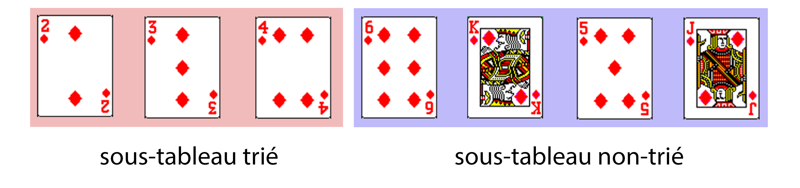

# Le tri par sélection

Le **tri par sélection** (du **minimum** ou du **maximum**) est un algorithme de tri par **comparaisons**.  
Il s'agit d'un algorithme simple mais qui est, comme on le verra, **inefficace**.

## Présentation du tri

### Avec un jeu de cartes

Pour comprendre le fonctionnement de ce tri, voici une petite activité à réaliser avec un **jeu de cartes** traditionnel.

On souhaite trier **une suite de 7 cartes** arbitrairement choisies.  
Par exemple :


On ne se souciera ici que des **valeurs** des cartes et non de leurs **couleurs**.  
Voici l'**ordre** des valeurs des cartes, de la **moins forte** à la **plus forte**, que l'on utilisera :


*Note* : Si la carte *Joker* existe dans votre jeu, on considèrera qu'elle est plus forte que toutes les autres cartes.

!!! abstract "Principe du tri par sélection"
    Le principe du **tri par sélection** du **minimum** est le suivant :

    1. Chercher l'**indice** de la **plus faible carte** de la suite (à partir de l'indice **0**) et **échanger** cette carte avec celle qui est placée en **premier**. La première carte est maintenant **la plus faible**.
    2. Chercher l'**indice** de la **plus faible carte** de la suite en partant du **2ème élément** (indice **1**) et **échanger** cette carte avec celle qui est placée en **deuxième**. Les **deux premières cartes** sont les plus faibles et sont maintenant **triées**.
    3. Poursuivre ainsi jusqu’à l’**avant dernière carte** de la suite.

<figure markdown>
  
  <figcaption>Exemple de déroulement du tri par sélection</figcaption>
</figure>

### Simulation avec des barres

Voici une simulation du **tri par sélection** en utilisant des barres de différentes tailles comme éléments.  
Le but est de trier les barres de la **plus petite** à **la plus grande**.

!!! success "Simulation du tri par sélection du minimum"
    <div id="controls">
        <button id="run-button" class="md-button">Exécuter</button>
        <button id="reinit-button" class="md-button">Réinitialiser</button>
        <button id="speed-up-button" class="md-button">Accélérer</button>
        <button id="speed-down-button" class="md-button">Ralentir</button>
    </div>
    <div id="bars-container"></div>

## L'algorithme

L'algorithme du **tri par sélection** peut être implémenté **en place** ou non.

!!! info "Tri en place"
    Un tri est dit *en place* s'il modifie directement la structure qu’il est en train de trier, plutôt que de créer et de renvoyer une nouvelle structure.

Ici, on ne renverra pas de nouveau tableau, on modifiera directement le tableau donné en entrée.  
Le tri s'effectuera par sélection **du minimum**.

Pour simplifier les choses, on commence par séparer l'algorithme de tri en **3 sous-algorithmes** :

- l'algorithme principal `tri_selection(tableau)` permettant de trier un **tableau d'éléments** avec le **tri par sélection**,
- l'algorithme `minimum(tableau, debut)` permettant la recherche de l'indice de l'**élément minimal** du tableau à partir de l'indice `debut` donné,
- l'algorithme `echanger(tableau, i, j)` permettant d'échanger **deux éléments** d'indices `i` et `j` donnés.

!!! abstract "Algorithme du tri par sélection"
    **ALGORITHME** : tri_selection  
    **ENTRÉES** :  
    &nbsp;&nbsp;&nbsp;&nbsp;`tableau` : un **tableau** d'éléments pouvant être **comparés**  
    **SORTIE** : aucune (tri *en place*)

    **DÉBUT**  
    &emsp;&emsp;n ← longueur(tableau)  
    &emsp;&emsp;**POUR** debut **ALLANT DE** 0 **À** n - 2  
    &emsp;&emsp;&emsp;&emsp;indice_min ← minimum(tableau, debut)  
    &emsp;&emsp;&emsp;&emsp;echanger(tableau, debut, indice_min)  
    &emsp;&emsp;**FIN POUR**   
    &emsp;&emsp;Renvoyer **∅**  
    **FIN ALGORITHME**

!!! abstract "Algorithme de recherche du minimum"
    **ALGORITHME** : minimum  
    **ENTRÉES** :  
    &nbsp;&nbsp;&nbsp;&nbsp;`tableau` : un **tableau** d'éléments  
    &nbsp;&nbsp;&nbsp;&nbsp;`debut` : l'**indice** à partir duquel effectuer la recherche  
    **SORTIE** : l'**indice** de l'élément minimal dans l'intervalle `[debut, longueur(tableau) - 1]` du tableau

    **DÉBUT**  
    &emsp;&emsp;indice_min ← debut  
    &emsp;&emsp;**POUR** i **ALLANT DE** debut + 1 **À** longueur(tableau) - 1  
    &emsp;&emsp;&emsp;**SI** tableau[i] < tableau[indice_min], **ALORS**  
    &emsp;&emsp;&emsp;&emsp;indice_min ← i  
    &emsp;&emsp;**FIN POUR**  
    &emsp;&emsp;Renvoyer indice_min  
    **FIN ALGORITHME**

!!! abstract "Algorithme d'échange d'éléments"
    **ALGORITHME** : echanger  
    **ENTRÉES** :  
    &nbsp;&nbsp;&nbsp;&nbsp;`tableau` : un **tableau** d'éléments  
    &nbsp;&nbsp;&nbsp;&nbsp;`i` : l'**indice** d'un élément du tableau  
    &nbsp;&nbsp;&nbsp;&nbsp;`j` : l'**indice** d'un autre élément du tableau  
    **SORTIE** : aucune (tri en place)

    **DÉBUT**  
    &emsp;&emsp;temp ← tableau[i]  
    &emsp;&emsp;tableau[i] ← tableau[j]  
    &emsp;&emsp;tableau[j] ← temp  
    &emsp;&emsp;Renvoyer **∅**  
    **FIN ALGORITHME**

Voici enfin une version en **un seul** algorithme :

!!! abstract "Algorithme du tri par sélection"
    **ALGORITHME** : tri_selection  
    **ENTRÉES** :  
    &nbsp;&nbsp;&nbsp;&nbsp;`tableau` : un **tableau** d'éléments pouvant être **comparés**.  
    **SORTIE** : aucune (tri *en place*)

    **DÉBUT**  
    &emsp;&emsp;n ← longueur(tableau)  
    &emsp;&emsp;**POUR** debut **ALLANT DE** 0 **À** n - 2  
    &emsp;&emsp;&emsp;&emsp;indice_min ← debut  
    &emsp;&emsp;&emsp;&emsp;**POUR** i **ALLANT DE** debut + 1 **À** n - 1  
    &emsp;&emsp;&emsp;&emsp;&emsp;&emsp;**SI** tableau[i] < tableau[indice_min], **ALORS**  
    &emsp;&emsp;&emsp;&emsp;&emsp;&emsp;&emsp;&emsp;indice_min ← i  
    &emsp;&emsp;&emsp;&emsp;**FIN POUR**  
    &emsp;&emsp;&emsp;&emsp;temp ← tableau[debut]  
    &emsp;&emsp;&emsp;&emsp;tableau[debut] ← tableau[indice_min]  
    &emsp;&emsp;&emsp;&emsp;tableau[indice_min] ← temp  
    &emsp;&emsp;**FIN POUR**   
    &emsp;&emsp;Renvoyer **∅**  
    **FIN ALGORITHME**

!!! note "Note"
    La première boucle **POUR** s'arrête à `n - 2` car si tous les éléments de l'intervalle `[0, longueur(tableau) - 2]` sont **triés**, l'élément d'**indice** `longueur(tableau) - 1` est obligatoirement déjà à la **bonne position**.

!!! note "Stabilité du tri"
    Un **tri** est dit **stable** s'il préserve l’**ordonnancement initial des éléments** que l'ordre considère comme égaux.  
    Le tri par sélection est, dans le cas de notre algorithme, **instable** car en cas de valeurs identiques dans le tableau initial, leur ordre relatif peut être modifié.

    *Exemple* : Avec le tableau `[2, 4a, 4b, 3, 7, 5]`, l'ordre des éléments de valeur `4` n'est pas conservé.

!!! note "Sélection du maximum"
    Si l'on souhait écrire cet algorithme en sélectionnant le **maximum** plutôt que le minimum, le principe serait le même, mais le parcours s'effectuerait du **dernier élément** au **premier élément** du tableau. Le tableau serait dans ce cas d'abord composé de la **partie non triée**, puis de la **partie triée**.

!!! note "<span id="a_vous">À vous de jouer</span>"
    **Question 1** : Déroulez le **tri par sélection** du minimum sur le tableau `[7, 1, 5, 3, 8, 5]` en vous aidant du tableau suivant :

    
    
    **Question 2** : Faites de même sur le tableau `[5, 3, 1, 4, 6, 2]`.

    **Question 3** : Même chose cette fois avec le tableau `['b', 'e', 'c', 'w', 'p', 'q']`. On utilisera l'ordre **lexicographique**.

??? tip "Correction"
    **Question 1** :

    

    **Question 2 et 3** : Même principe.  
    Pour la **question 3**, la comparaison se fait par ordre **lexicographique** (a < b < c < d < ... < x < y < z).

## Implémentation du tri par sélection

On va maintenant implémenter l'algorithme du **tri par sélection** en **Python**.  
Les **tableaux** seront représentés par des **listes Python** (objets de type `list`).

!!! note "Question préliminaire"
    Les **listes Python** sont-elles des structures de données **mutables** ou non ?
    Citer 2 structures **mutables** et deux structures **non-mutables** en Python.

*Note* : Pour simplifier, on parlera de *tableaux triés* pour parler de *tableaux triés dans l'ordre croissant*.

!!! success "<span id="fichiers_python">Fichiers Python</span>"
    - [tri_selection.py](src/tri_selection.py) : programme **Python** avec les fonctions à compléter.
    - [tri_selection_corr.py](src/tri_selection_corr.py) : correction de l'implémentation des fonctions.

!!! note "Question 1"
    1. Compléter les fonctions : 
        - `minimum(tableau, debut)` : renvoie l'**indice** de l'élément de **valeur minimale** dans l'intervalle `[debut, len(tableau) - 1]`.
        - `echanger(tableau, i, j)` : échange les éléments d'indices `i` et `j` du tableau `tableau`.
    2. Compléter la fonction `tri_selection(tableau)` qui effectue le **tri par sélection** des éléments d'un tableau `tableau` donné, en réutilisant les deux fonctions précédentes.
    3. Est-il nécessaire de mettre un `return None` ? Pourquoi ?
    4. Peut-on dire que la fonction `tri_selection` est une **procédure** ? Pourquoi ?

??? tip "Correction question 1"
    **1** -

    ```python
    def minimum(tableau: 'list[int]', debut: int) -> int:
    ''' Renvoie l'indice de la valeur minimale du tableau dans l'intervalle [debut, len(tableau) - 1].
    :param tableau: (list[int]) un tableau d'entiers
    :param debut: (int) l'indice à partir duquel on recherche le minimum
    :return: (int) l'indice du minimum '''

    indice_min = debut  # Initialiser l'indice du minimum à debut
    for i in range(debut + 1, len(tableau)):  # Parcourir tous les éléments du tableau à partir de debut + 1
        if tableau[i] < tableau[indice_min]:  # Si l'élément d'indice i est inférieur à celui d'indice indice_min
            indice_min = i  # Le nouvel indice du minimum est i
    return indice_min  # Renvoyer l'indice du minimum

    def echanger(tableau: 'list[int]', i: int, j: int) -> None:
        ''' Echanger deux éléments d'un tableau
        :param tableau: (list[int]) un tableau d'entiers
        :param i: (int) l'indice d'un élément du tableau
        :param j: (int) l'indice d'un élément du tableau '''

        temp = tableau[i]
        tableau[i] = tableau[j]
        tableau[j] = temp

    def tri_selection(tableau: 'list[int]') -> None:
        ''' Effectue le tri par sélection en place des éléments d'un tableau donné.
        :param tableau: (list[int]) un tableau d'entiers à trier '''

        n = len(tableau)  # Récupérer la longueur du tableau
        for debut in range(0, n - 1):  # Parcourir tous les éléments jusqu'à l'avant dernier (*)
            indice_min = minimum(tableau, debut)  # Récupérer l'indice du minimum
            echanger(tableau, debut, indice_min)  # Echanger les éléments d'indices debut et indice_min
    ```

    **2** - Ce n'est pas nécessaire. Lorsqu'on ne met pas de `return`, cela revient à renvoyer `None` (c'est-à-dire *rien*).

    **3** - La fonction `tri_selection` **ne renvoie rien**. Une fonction qui ne renvoie rien (et qui fonctionne donc uniquement par *effets de bord*) peut être appelée **procédure**. Attention toutefois, en *Python*, il n'existe pas de **type 'procédure'**, il n'existe que des **fonctions** (type `function`).

!!! tip "Tester ma fonction"
    Le programme est muni de **tests** (lignes `13` à `22`) exécutés par le module *Doctest*.  
    Vous pouvez donc **tester vos fonctions** en exécutant simplement le programme. Si rien ne se passe, c'est que tout est bon. Sinon, l'interpréteur indiquera les tests qui ont échoué.

    (Vous pouvez rajouter d'autres tests ou effectuer des tests sur l'interpréteur si vous le souhaitez.)

!!! note "Question 2"
    Compléter la fonction `tri_selection_tout_en_un(tableau)` en ré-écrivant le **tri par sélection** sans appeler d'autres fonctions (les **recherches du minimum** et les **échanges** sont effectués **directement dans cette fonction**).

??? tip "Réponse question 2"

    ```python
    def tri_selection_tout_en_un(tableau: 'list[int]') -> None:
    ''' Effectue le tri par sélection en place des éléments d'un tableau donné.
    
    :param tableau: (list[int]) un tableau d'entiers à trier '''

    n = len(tableau)  # Récupérer la longueur du tableau
    for debut in range(0, n - 1):  # Parcourir tous les éléments jusqu'à l'avant dernier (*)
        indice_min = debut  # Initialiser l'indice du minimum à debut
        for i in range(debut + 1, len(tableau)):  # Parcourir tous les éléments du tableau à partir de debut + 1
            if tableau[i] < tableau[indice_min]:  # Si l'élément d'indice i est inférieur à celui d'indice indice_min
                indice_min = i  # Le nouvel indice du minimum est i
        # On effectue une permutation
        temp = tableau[debut]
        tableau[debut] = tableau[indice_min]
        tableau[indice_min] = temp
    ```

!!! note "Question 3"
    Écrire la fonction `tri_selection_decroissant(tableau)` qui effectue le **tri par sélection** des éléments d'un tableau dans l'**ordre décroissant**.

??? tip "Réponse question 3"

    ```python
    def tri_selection_decroissant(tableau: 'list[int]') -> None:
    ''' Effectue le tri par sélection dans l'ordre décroissant des éléments d'un tableau donné.
    :param tableau: (list[int]) un tableau d'entiers à trier '''

    n = len(tableau)  # Récupérer la longueur du tableau
    for debut in range(0, n - 1):  # Parcourir tous les éléments jusqu'à l'avant dernier (*)
        indice_max = debut  # Initialiser l'indice du maximum à debut
        for i in range(debut + 1, len(tableau)):  # Parcourir tous les éléments du tableau à partir de debut + 1
            if tableau[i] > tableau[indice_max]:  # Si l'élément d'indice i est inférieur à celui d'indice indice_max
                indice_max = i  # Le nouvel indice du minimum est i
        # On effectue une permutation
        temp = tableau[debut]
        tableau[debut] = tableau[indice_max]
        tableau[indice_max] = temp
    ```

!!! note "Question 4"
    Dans les **tests**, à la ligne `19`, on trouve l'instruction `l = [randint(0, 100) for _ in range(20)]`.  
    Que fait cette instruction ? Quel est le nom de la **méthode** de **création de liste** utilisée ?

??? tip "Réponse question 4"
    Cette instruction crée une **liste Python** contenant **20 entiers aléatoires** compris entre **0** et **100**.  
    La création est effectuée **par compréhension**.

## Coût du tri par sélection

Voyons à présent quel est le **coût** du **tri par sélection**.  

Le coût d'un algorithme peut être déterminé en comptant le nombre d'**opérations élémentaires** réalisées. Ces opérations peuvent être par exemple des **affectations**, des **tests**, des **opérations arithmétiques**, des **accès à un élément d'une liste**, etc.

Dans notre cas, on ne prendra en compte que le **nombre de comparaisons entre deux éléments** effectué par notre algorithme.  
Les comparaisons sont en l'occurence effectuées dans l'algorithme `minimum` :

```
...
SI tableau[i] < tableau[indice_min], ALORS
...
```

On rappelle l'algorithme du **tri par sélection** et de **recherche du minimum** :

!!! abstract "Algorithme du tri par sélection"
    **ALGORITHME** : tri_selection  
    **ENTRÉES** :  
    &nbsp;&nbsp;&nbsp;&nbsp;`tableau` : un **tableau** d'éléments pouvant être **comparés**  
    **SORTIE** : aucune (tri *en place*)

    **DÉBUT**  
    &emsp;&emsp;n ← longueur(tableau)  
    &emsp;&emsp;**POUR** debut **ALLANT DE** 0 **À** n - 2  
    &emsp;&emsp;&emsp;&emsp;indice_min ← minimum(tableau, debut)  
    &emsp;&emsp;&emsp;&emsp;echanger(tableau, debut, indice_min)  
    &emsp;&emsp;**FIN POUR**   
    &emsp;&emsp;Renvoyer **∅**  
    **FIN ALGORITHME**

!!! abstract "Algorithme de recherche du minimum"
    **ALGORITHME** : minimum  
    **ENTRÉES** :  
    &nbsp;&nbsp;&nbsp;&nbsp;`tableau` : un **tableau** d'éléments  
    &nbsp;&nbsp;&nbsp;&nbsp;`debut` : l'**indice** à partir duquel effectuer la recherche  
    **SORTIE** : l'**indice** de l'élément minimal dans l'intervalle `[debut, longueur(tableau) - 1]` du tableau

    **DÉBUT**  
    &emsp;&emsp;indice_min ← debut  
    &emsp;&emsp;**POUR** i **ALLANT DE** debut + 1 **À** longueur(tableau) - 1  
    &emsp;&emsp;&emsp;**SI** tableau[i] < tableau[indice_min], **ALORS**  
    &emsp;&emsp;&emsp;&emsp;indice_min ← i  
    &emsp;&emsp;**FIN POUR**  
    &emsp;&emsp;Renvoyer indice_min  
    **FIN ALGORITHME**

!!! note "Question 1"
    On souhaite calculer le **nombre de comparaisons** effectué pour **trier** le tableau `[3, 7, 1, 6, 5, 2]`.

    **Compléter** le tableau suivant en indiquant le **nombre de comparaisons** effectué après chaque **itération** de la **boucle principale** `POUR debut ALLANT DE 0 À n - 2`, c'est-à-dire le nombre de comparaisons effectué par l'algorithme `minimum(tableau, debut)` pour chaque valeur de `debut` de `0` à `n`, `n` étant la **longueur du tableau**.

    | itération k = | `debut` | tableau après itération k | nombre de comparaisons |
    | ------------- | ------- | ------------------------- | ---------------------- |
    | 1             | 0       | [1, **7, 3, 6, 5, 2**]    | ...                    |
    | 2             | 1       | [1, 2, **3, 6, 5, 7**]    | ...                    |
    | 3             | 2       | [1, 2, 3, **6, 5, 7**]    | ...                    |
    | 4             | 3       | [1, 2, 3, 5, **6, 7**]    | ...                    |
    | 5             | 4       | [1, 2, 3, 5, 6, **7**]    | ...                    |

    Calculer le nombre de comparaisons **au total**, noté $C(6)$, effectué pour trier ce tableau.

??? tip "Réponse question 1"
    | itération k = | `debut` | tableau après itération k | nombre de comparaisons |
    | ------------- | ------- | ------------------------- | ---------------------- |
    | 1             | 0       | [1, **7, 3, 6, 5, 2**]    | 5                      |
    | 2             | 1       | [1, 2, **3, 6, 5, 7**]    | 4                      |
    | 3             | 2       | [1, 2, 3, **6, 5, 7**]    | 3                      |
    | 4             | 3       | [1, 2, 3, 5, **6, 7**]    | 2                      |
    | 5             | 4       | [1, 2, 3, 5, 6, **7**]    | 1                      |

    Lors de la première itération, on effectue **5 comparaisons**. Lors de la seconde itération, on effectue **4 comparaisons**. Et ainsi de suite. Le **nombre de comparaisons** effectué au total pour un **tableau de longueur** $n = 6$ est donc :

    $$
    C(6) = 5 + 4 + 3 + 2 + 1 = 15
    $$

    Pour un **tableau de longueur** $n = 7$ par exemple, le **nombre de comparaisons** serait :

    $$
    C(7) = 6 + 5 + 4 + 3 + 2 + 1 = 6 + C(6) = 21
    $$

!!! note "Question 2"
    Si l'on change les éléments du tableau de la question précédente, le **nombre de comparaisons** change t-il ? Pourquoi ?

??? tip "Réponse question 2"
    **Non**, le tri par sélection effectue **toujours** une comparaison avec tous les éléments de la **partie non-triée** du tableau lors de la **recherche du minimum**. Le nombre de comparaisons effectué ne dépend que de la **longueur** du tableau, et non pas des éléments en eux-même.

!!! note "Question 3"
    Calculer le **nombre de comparaisons**, noté $C(n)$, pour un tableau de taille $n$.  
    Finalement, quelle est la **complexité** du **tri par sélection** ? (Voir l'aide ci-dessous si nécessaire.)

!!! tip "Calcul de la somme des termes d'une suite arithmétique"
    On rappelle la formule permettant de calculer la somme des $n + 1$ premiers termes d'une **suite arithmétique** :

    $$
    S = u_0 + u_1 + ... + u_n
    $$

    $$
    S = \frac{n+1}{2}(u_0 + u_n)
    $$

    $$
    S = \frac{(1er~terme + dernier~terme) \times (nombre~de~termes)}{2}
    $$

    Par exemple :

    $$
    S = 1 + 2 + ... + n = \frac{n(n+1)}{2}
    $$

    $$
    S = \sum_{x=0}^{n}x = \frac{n(n+1)}{2}
    $$

??? tip "Réponse question 3"
    $$
    C(n) = 1 + 2 + [...] + (n - 2) + (n - 1) = \frac{(n - 1)n}{2}
    $$

    $$
    C(n) = \sum_{x=1}^{n-1}x = \frac{(n - 1)n}{2}
    $$

    La complexité est donc **quadratique** (si l'on double la taille du tableau en entrée, le temps d'exécution sera multiplié par 4.)  
    Étant donné que la complexité est la même quels que soient les éléments du tableau fourni en entrée, on peut utiliser la notation **grand-theta**. On peut écrire que la complexité de l'algorithme du **tri par sélection** est en $\Theta(n^2)$.

!!! tip "Rappel sur les complexités"
    Voici un rappel sur les différentes complexités :
    
    - Logarithmique $Θ(log~n)$ : la complexité évolue **moins vite** que le nombre **n** de données (par exemple : si on multiplie le nombre de données **n** par **2**, on ne rajoute qu'**une seule** opération).
    - Linéaire $Θ(n)$ : la complexité évolue **comme** le nombre **n** de données (par exemple : si on multiplie le nombre de données **n** par **2**, le temps d'exécution est multiplié par **2**).
    - Quasi-linéaire $O(n~log~n)$ : Intermédiaire entre linéaire et quadratique. En pratique, un algorithme de complexité quasi-linéaire a un comportement très proche d’un algorithme de complexité linéaire.
    - Quadratique $Θ(n^2)$ : la complexité évolue **comme le carré** du nombre **n** de données (par exemple : si on multiplie le nombres de données **n** par **2**, le temps d'exécution est multiplié par **4**).
    - Exponentielle $Θ(2^n)$ : la complexité évolue à terme **beaucoup plus vite** que n'importe quelle fonction polynomiale du nombre **n** de données (par exemple : si on multiplie le nombre de données **n** par **100**, le temps d'exécution est multiplié par $2^{100}$, soit **1267650600228229401496703205376**).

    <figure markdown>
    <center>
    
    <figcaption>Courbes d'évolution des différentes complexités algorithmiques.<br />(généré avec [ce programme](src/graphique_complexites.py){ target="_blank" })</figcaption>
    </center>
    </figure>

!!! success "À télécharger (facultatif)"
    Récupérer le fichier [analyse_tri_selection.py](src/analyse_tri_selection.py).
    
    Ce fichier permet de **compter le nombre de comparaisons** effectué par le **tri par sélection**, en utilisant une **variable globale** `CNT` incrémentée à chaque comparaison de deux éléments effectuée.

    Vous pouvez modifier l'instruction à la ligne `38` en changeant le tableau pour lequel vous souhaitez compter le nombre de comparaisons.

## Terminaison du tri par sélection

!!! success "Variant de boucle"
    On appelle **variant de boucle** toute **quantité** $v$ (qui peut être déterminée en fonction des différentes **variables** du programme) telle que :

    - $v$ ne prend que des valeurs **entières**,
    - $v$ est initialement **positive**,
    - $v$ **décroit strictement** à chaque passage dans la boucle.
    
    On exhibe un **variant de boucle** pour démontrer qu'une boucle **se termine**, en un temps fini.   
    S'il existe plusieurs boucles dans un programme, il faut trouver autant de variants qu'il y en a.

!!! tip "Prouver la terminaison"
    Concrètement, on peut prouver la **terminaison** d'un algorithme en montrant que les deux propositions suivantes sont **vraies** :

    - Proposition A : les **boucles** peuvent s'exprimer sous la forme **TANT QUE** <span style="color:#23ab32">VARIANT</span> **> 0**
    - Proposition B : le <span style="color:#23ab32">VARIANT</span> est une **suite d'entiers strictement décroissante**.

    Si les deux propositions **A** et **B** sont vraies ($A \land B$), l'algorithme s'arrêtera **toujours**. Autrement (au moins l'une des deux propositions n'est pas vérifiée, $\neg(A \land B)$), il existe au moins un cas où l'algorithme ne se terminera pas.


!!! info "Exemple"
    Démontrons que la boucle **POUR** suivante se termine :

    ```
    POUR i ALLANT DE 10 à 49 AVEC UN PAS DE 5:
        Instructions ne modifiant pas la valeur de i...
    ```

    On peut ré-écrire cette boucle **POUR** avec une boucle **TANT QUE** :

    ```
    i = 10
    TANT QUE i < 50:
        Instructions ne modifiant pas la valeur de i...
        i = i + 5
    ```

    Si on note $n$ le **nombre de tours de boucle** effectué, on peut représenter les valeurs successives que va prendre $i$ sous la forme d'une suite arithmétique :  
    $i_n = i_0 + r*n$, avec $i_0$ la **valeur initiale** de $i_n$ et $r$ la **raison** de la suite.

    Ici, $i_0 = 10$ et $r = 5$.  
    Donc $i_n = 10 + 5n$.

    On peut donc ré-écrire la condition **TANT QUE** de la manière suivante :

    TANT QUE $i_n < 50$  
    TANT QUE $10 + 5n < 50$  
    TANT QUE $0 < 50 - 10 - 5n$  
    TANT QUE $50 - 10 - 5n > 0$  
    TANT QUE $40 - 5n > 0$

    On obtient donc notre **variant** $v_n$ qui prend la forme d'une nouvelle **suite arithmétique** :  
    $v_n = v_0 - r*n$ avec $v_0 = 40$ pour **valeur initiale** et $r = -5$ pour **raison** de la suite.  
    Donc :  
    $v_n = 40 - 5n$ est un **variant de la boucle** car il s'agit d'une suite **d'entiers**, **initialement positive** et qui **décroit strictement** à chaque tour de boucle (car la **raison** est **négative**).

    On a trouvé un **variant**, et donc **démontré la terminaison de notre boucle**.

!!! note "Question 1"
    Montrer la terminaison de l'algorithme de **recherche du minimum**.

    ??? abstract "Algorithme de recherche du minimum"
        **ALGORITHME** : minimum  
        **ENTRÉES** :  
        &nbsp;&nbsp;&nbsp;&nbsp;`tableau` : un **tableau** d'éléments  
        &nbsp;&nbsp;&nbsp;&nbsp;`debut` : l'**indice** à partir duquel effectuer la recherche  
        **SORTIE** : l'**indice** de l'élément minimal dans l'intervalle `[debut, longueur(tableau) - 1]` du tableau

        **DÉBUT**  
        &emsp;&emsp;indice_min ← debut  
        &emsp;&emsp;**POUR** i **ALLANT DE** debut + 1 **À** longueur(tableau) - 1  
        &emsp;&emsp;&emsp;**SI** tableau[i] < tableau[indice_min], **ALORS**  
        &emsp;&emsp;&emsp;&emsp;indice_min ← i  
        &emsp;&emsp;**FIN POUR**  
        &emsp;&emsp;Renvoyer indice_min  
        **FIN ALGORITHME**

??? tip "Astuce question 1"
    La démarche à suivre est similaire à celle de l'exemple précédent.

    - Ré-écrire la boucle **POUR** sous la forme d'une boucle **TANT QUE**.
    - Exprimer $i$ en fonction du nombre de tours de boucle $n$ sous la forme d'une **suite entière arithmétique** croissante ($i_n = i_0 + r*n$ où $i_0$ est le **terme initial** et $r$ est la **raison**).
    - Écrire la condition du **TANT QUE** en partant de l'inégalité de départ et de l'expression de $i_n$, et tenter d'obtenir une nouvelle inégalité de la forme $v_n > 0$, où $v_n$ est une **suite d'entiers strictement décroissante**.
    - On a trouvé un **variant** $v_n$ : La boucle se termine !

???+ tip "Réponse question 1"
    Pour montrer la **terminaison** de cet algorithme, il faut **prouver la terminaison de la boucle POUR**.

    On réécrit la boucle **POUR** sous la forme d'une boucle **WHILE** :

    ---
    i = debut + 1  
    **TANT QUE** i < longueur(tableau):  
    &emsp;&emsp;(instructions qui ne modifient pas la valeur de i)  
    &emsp;&emsp;i = i + 1
    ---

    Exprimons $i$ sous la forme d'une **suite arithmétique** en fonction de $n$, $n$ étant **le nombre de tours de boucles effectué**. Avant de rentrer dans la boucle, $n$ vaut $0$.

    $i_n = i_0 + rn$ avec $r$ la **raison de la suite arithmétique**, qui correspond au **pas** de la boucle. Après chaque itération, on **incrémente** $i$ de **1**, donc $r = 1$.    
    Donc $i_n = debut + 1 + 1*n$,  
    $i_n = debut + 1 + n$.

    Donc, si l'on réécrit le **TANT QUE** :

    ---
    **TANT QUE** i<sub>n</sub> < longueur(tableau)  
    **TANT QUE** debut + 1 + n < longueur(tableau)  
    En réécrivant sous la forme **TANT QUE** <span style="color:blue">VARIANT</span> > 0 :  
    **TANT QUE** 0 < longueur(tableau) - debut - 1 - n  
    **TANT QUE** longueur(tableau) - debut - 1 - n > 0
    ---

    On obtient une **nouvelle suite arithmétique**, qu'on notera $v_n$, telle que :  
    $v_n = v_0 + rn$ avec $v_0$ = $longueur(tableau) - debut - 1$ et $r = -1$.

    $v_0$ étant un **entier positif** (car $longueur(tableau) - debut - 1$ vaut toujours au minimum **1**), et la **raison** étant **négative** (ce qui indique que la **suite est strictement décroissante**), on peut donc dire que $v_n$ est bien un **variant de la boucle** et que notre boucle **se termine**.

    On a prouvé la terminaison de la seule boucle de l'algorithme, on peut donc en conclure que `minimum` **se termine**.

!!! note "Question 2"
    Montrer enfin la terminaison de l'algorithme du **tri par sélection**.

    ??? abstract "Algorithme du tri par sélection"
        **ALGORITHME** : tri_selection  
        **ENTRÉES** :  
        &nbsp;&nbsp;&nbsp;&nbsp;`tableau` : un **tableau** d'éléments pouvant être **comparés**  
        **SORTIE** : aucune (tri *en place*)

        **DÉBUT**  
        &emsp;&emsp;n ← longueur(tableau)  
        &emsp;&emsp;**POUR** debut **ALLANT DE** 0 **À** n - 2  
        &emsp;&emsp;&emsp;&emsp;indice_min ← minimum(tableau, debut)  
        &emsp;&emsp;&emsp;&emsp;echanger(tableau, debut, indice_min)  
        &emsp;&emsp;**FIN POUR**   
        &emsp;&emsp;Renvoyer **∅**  
        **FIN ALGORITHME**

??? tip "Astuce question 2"
    - On a montré que `minimum`se termine,
    - la fonction `echanger` se termine (car il s'agit simplement de trois affectations),
    - il ne reste plus qu'à montrer que la **boucle principale** se termine, avec la même démarche que précédemment.

???+ tip "Réponse question 2"
    On a précédemment montré que `minimum` se terminait, et l'algorithme `echanger` se termine également (car il s'agit simplement de **trois affectations**), il reste donc à démontrer que la **boucle POUR principale** de `tri_selection` se termine. Le principe est le même que précédemment.

    On réécrit la boucle **POUR** sous la forme d'une boucle **WHILE**.  
    **ATTENTION** : Il y a une variable nommée `n` dans l'algorithme qui correspond à **la longueur du tableau**. Pour ne pas mélanger la longueur du tableau avec **le nombre de tours de boucle** effectué (que l'on note également $n$), on remplacera le `n` de l'algorithme par `longueur(tableau)`.

    ---
    debut = 0  
    **TANT QUE** debut < longueur(tableau) - 1:  
    &emsp;&emsp;(instructions qui ne modifient pas la valeur de debut)  
    &emsp;&emsp;debut = debut + 1
    ---

    Exprimons $debut$ sous la forme d'une **suite arithmétique** en fonction de $n$, $n$ étant **le nombre de tours de boucles effectué**. Avant de rentrer dans la boucle, $n$ vaut $0$.

    $debut_n = debut_0 + rn$ avec $r$ la **raison de la suite arithmétique**, qui correspond au **pas** de la boucle. Après chaque itération, on **incrémente** $debut$ de **1**, donc $r = 1$.    
    Donc $debut_n = 0 + 1*n$,  
    $debut_n = n$.

    Donc, si l'on réécrit le **TANT QUE** :

    ---
    **TANT QUE** debut<sub>n</sub> < longueur(tableau) - 1  
    **TANT QUE** n < longueur(tableau) - 1  
    En réécrivant sous la forme **TANT QUE** <span style="color:blue">VARIANT</span> > 0 :  
    **TANT QUE** longueur(tableau) - 1 - n > 0
    ---

    On obtient une **nouvelle suite arithmétique**, qu'on notera $v_n$, telle que :  
    $v_n = v_0 + rn$ avec $v_0$ = $longueur(tableau) - 1$ et $r = -1$.

    $v_0$ étant un **entier positif** (car on ne rentre dans la boucle que si $longueur(tableau) - 1$ vaut au moins **1**), et la **raison** étant **négative** (ce qui indique que la **suite est strictement décroissante**), on peut donc dire que $v_n$ est bien un **variant de la boucle** et que notre boucle **se termine**.

    On a prouvé la terminaison de notre boucle, on peut donc en déduire que `tri_selection` **se termine**.


## Preuve de correction du tri par sélection

Dans les deux parties précédentes, nous avons montré :

- Le **coût algorithmique** de l'algorithme du tri par sélection, qui est **toujours quadratique**, c'est-à-dire en $\Theta(n^2)$. Cela signifie que si l'on **double** la taille de l'entrée, le temps d'exécution sera à peu près **multiplié par 4**.
- La **terminaison** de l'algorithme. On sait que l'algorithme finira toujours par se terminer.

Il reste toutefois à démontrer que l'algorithme **renvoie toujours un résultat correct**.

!!! warning "Attention"
    Dans notre implémentation en Python, on a effectué quelques tests (avec une *doctest* notamment) pour vérifier le fonctionnement de l'algorithme. Toutefois, cela **ne prouve pas que l'algorithme est correct**, seulement qu'il fonctionne avec un jeu de tests défini.

    Dans notre cas, il y a une **infinité d'entrées** possibles qui respectent la spécification, on ne peut donc pas démontrer la correction de notre algorithme en se contentant d'effectuer des tests.

La **preuve de correction** d'un algorithme permet d'affirmer :

- qu'il **fournit toujours la bonne réponse**
- sur **toutes les entrées valides** qu'on lui donne (les entrées qui respectent les **préconditions**).

Pour démontrer la correction, il faut déterminer un **invariant de boucle** pour la **boucle principale** de notre algorithme.

!!! tip "Invariant de boucle"
    On appelle **invariant de boucle** une **propriété** $P$ qui est **vraie avant et après chaque itération** de la boucle.

L'invariant ainsi déterminé permettra de prouver que le résultat final après exécution est bien le résultat attendu.

Il n'existe pas de méthodologie miracle permettant de déterminer systématiquement un **invariant**. Cela demande de chercher et de tester des choses jusqu'à trouver une propriété qui convienne.

Une fois qu'une propriété a été déterminée, il faut la **démontrer** en utilisant un **raisonnement par récurrence**.

!!! tip "Démonstration de l'invariant par récurrence"
    Pour montrer à l'aide d'une **récurrence simple** qu'une proposition $P(k)$ est vérifiée pour tout entier $k \ge 0$, avec $k$ le nombre d'itérations de la boucle effectuées :
    
    - **Initialisation** : on vérifie que la proposition est **vraie** au **rang initial** $0$, c'est-à-dire **avant le premier passage** dans la **boucle**.
    - **Conservation** : on suppose que la proposition est **vraie à un certain rang** $k \ge 0$ fixé, c'est-à-dire **après** $k$ **tours de boucle**, et on en déduit qu'elle est **vraie** au **rang suivant** $k + 1$, c'est-à-dire après **un tour de boucle en plus**. On peut écrire $P_k \implies P_{k+1}$.
    - **Terminaison** : on exploite les deux phases précédentes et on montre que la proposition est **vraie** sur **toutes les données** une fois la **dernière itération** de la **boucle** effectuée.

---

Dans la cas du tri par sélection, on peut décomposer le problème en :

- un **sous-tableau trié** à gauche,
- un **sous-tableau non-trié** à droite.

{ width="80%" }

À chaque itération de la boucle principale, on **sélectionne le minimum** dans le **sous-tableau non-trié** et on le place à la fin du **sous-tableau trié**.

Initialement (avant d'entrer la première fois dans la boucle), le **sous-tableau trié** est vide, et on y **ajoute un élément** à chaque tour de boucle.

!!! success "Une proposition d'invariant"
    On propose l'invariant $P_k$ suivant : « après $k$ tours de boucle, $k$ **éléments sont triés dans le sous-tableau** $[0, k-1]$ **de gauche**. »

!!! abstract "Algorithme du tri par sélection"
    **ALGORITHME** : tri_selection  
    **ENTRÉES** :  
    &nbsp;&nbsp;&nbsp;&nbsp;`tableau` : un **tableau** d'éléments pouvant être **comparés**  
    **SORTIE** : aucune (tri *en place*)

    **DÉBUT**  
    &emsp;&emsp;n ← longueur(tableau)  
    &emsp;&emsp;**POUR** debut **ALLANT DE** 0 **À** n - 2  
    &emsp;&emsp;&emsp;&emsp;indice_min ← minimum(tableau, debut)  
    &emsp;&emsp;&emsp;&emsp;echanger(tableau, debut, indice_min)  
    &emsp;&emsp;**FIN POUR**   
    &emsp;&emsp;Renvoyer **∅**  
    **FIN ALGORITHME**

!!! note "Question 1 : Initialisation"
    - Après **0 tour de boucle**, c'est-à-dire avant d'entrer une première fois dans la boucle, combien y a t-il d'éléments dans le **sous-tableau trié** ?
    - La proposition $P_0$ est-elle vérifiée ?

??? tip "Réponse 1"
    Avant d'entrer une première fois dans la boucle, le sous-tableau trié ne contient aucun élément.  
    La proposition $P_0$ peut se lire : « après $0$ tour de boucle, $0$ **élément est trié dans le sous-tableau** $[]$ **de gauche**. »

    Un tableau **vide** est bien **trié**, l'invariant est donc vérifié pour $P_0$.

On a vu que l'invariant **était bien vérifié** pour $P_0$, c'est-à-dire avant d'entrer une première fois dans la boucle.

!!! note "Question 2"
    Quelle valeur va prendre `debut` lors de la **première itération** de la boucle principale ? Que va contenir `tableau[debut]` après **la première itération** de la boucle ? Combien d'éléments $k$ contiendra le **sous-tableau trié** après cette itération ?

    Quelle valeur va prendre `debut` lors de la **seconde itération** de la boucle principale ? Combien d'éléments $k$ seront ainsi triés après cette itération ?

    Établir une relation entre le nombre de tours de boucle $k$ et `debut`.

??? tip "Réponse 2"
    Après exécution de la première itération $k = 1$ de la boucle principale, `debut` vaut **0** et on a échangé l'élément minimal du tableau avec le premier élément (indice 0). `tableau[0]` contient donc à présent le plus petit élément du tableau.  
    Après exécution de la seconde itération $k = 2$, on échange l'élément minimal du **sous-tableau non-trié** avec le second élément du tableau. Le nombre d'éléments triés augmente donc de 1.

    | k    | `debut` | nombre d'éléments triés (= k) |
    | ---- | ------- | ----------------------------- |
    | 0    |         | 0                             |
    | 1    | 0       | 1                             |
    | 2    | 1       | 2                             |
    | 3    | 2       | 3                             |

    etc.

    La relation entre $k$ et $debut$ peut donc être facilement définie : $k = debut + 1$.

On fait maintenant l'hypotèse que $P_k$ est vraie pour un $k \ge 0$ fixé.  
Après $k$ tours de boucle, le **sous-tableau trié** contient $k$ éléments et le tableau se compose :

- d'un **sous-tableau trié** sur $[0, k-1]$
- d'un **sous-tableau non-trié** sur $[k, longueur(tableau) - 1]$

Démontrons maintenant la **conservation**.

!!! note "Question 3 : Conservation"
    Montrer que l'implication $P_k \implies P_{k+1}$ est **vraie**.

??? tip "Astuces question 3"
    Vous pouvez procéder comme suit :

    - Définir l'**état du système** à la **fin de l'itération** $k$ de la **boucle principal**, notamment **le nombre d'éléments triés** (et l'intervalle correspondant) et le **contenu de la variable** `debut`.
    - Supposer que la proposition $P_k$ est vraie. Détailler ce qu'il se passe lorsque l'on refait un **tour de boucle**.
    - En déduire l'**état du système** à l'issue de l'itération $k + 1$ de la **boucle principale**.

??? tip "Réponse 3"
    Définissons l'état du système à la fin de l'itération $k$ de la **boucle principale**.

    À la fin de l'itération $k$, nous avons :

    - $k$ éléments triés dans l'intervalle $[0, k-1]$
    - une variable `debut` contenant $k-1$ puisque, comme déterminé dans la question précédente, $k = debut + 1$.

    On suppose que $P_k$ est **vraie**, c'est-à-dire que le sous-tableau $[0, k-1]$ est **trié**.

    Si l'on refait un tour de boucle, on incrémente `debut` (car boucle **POUR**).  
    $debut = k - 1 + 1$  
    Donc :  
    $debut = k$

    On cherche donc dans le **sous-tableau non-trié** $[k, longueur(tableau) - 1]$ l'**élément minimal** (à l'aide de la fonction `minimum`) à placer à l'indice $k$.

    **FINALEMENT**, à l'issue de l'itération $k + 1$ de la boucle :

    - Les éléments de $[0, k-1]$ sont **toujours triés** (on n'a pas effectué de changement).
    - L'élément d'indice $k$ est **plus grand ou égal** aux éléments sur $[0, k - 1]$, autrement, il aurait déjà été dans le sous-tableau trié.

    **Donc, après $k + 1$ itérations, les $k + 1$ éléments du sous-tableau $[0, k]$ sont triés.**

    La **conservation de l'invariant** après chaque tour de boucle est ainsi démontré, et l'implication $P_k \implies P_{k+1}$ est vérifiée.

Rappelons notre invariant $P_k$ : « après $k$ tours de boucle, $k$ **éléments sont triés dans le sous-tableau** $[0, k-1]$ **de gauche** » et que :

- dans la phase d'**<u>initialisation</u>**, on a montré que l'**invariant** $P_0$ était **vrai avant la première itération** de la **boucle POUR principale**,
- avec la **<u>conservation</u>**, on a montré que l'implication $P_k \implies P_{k+1}$, donc que l'**invariant** restait **vrai après chaque tour de boucle**.

On rappelle que la relation entre $k$ et la variable de boucle $debut$ est $k = debut + 1$ et que :

- à la fin de la **première itération** $k = 1$, `debut` vaut 0 et on a **1 élément trié**,
- à la fin de la **seconde itération** $k = 2$, `debut` vaut 1 et on a **2 éléments triés**,
- à la fin de la **troisième itération** $k = 3$, `debut` vaut 2 et on a **3 éléments triés**,
- et ainsi de suite...

**DONC**, à la fin de la boucle `POUR debut ALLANT DE 0 À n - 2`, `debut`vaut $n - 2$ avec $n = longueur(tableau)$ et donc :  
$k = debut + 1$  
$k = longueur(tableau) - 2 + 1$  
$k = longueur(tableau) - 1$

Cela signifie qu'il y a $longueur(tableau) - 1$ éléments triés, donc **tous les éléments du tableau sauf le dernier sont triés**.

Or, **si tous les éléments sur** $[0, longueur(tableau) - 2]$ sont **triés**, alors **l'élément d'indice** $longueur(tableau) - 1$ est lui aussi **trié**, puisque le dernier élément est **supérieur** (ou *égal*) à tous les éléments du **sous-tableau trié**. Il est donc déjà à la **bonne position**.

On a donc ainsi démontré la **correction de l'algorithme de tri par sélection**.

## Vérifier l'invariant avec une assertion

Vérifions la validité de notre **invariant** sur la fonction `tri_selection` réalisée précédemment en **Python**.

La fonction `est_trie(tableau, fin)` renvoie `True` si les éléments du **sous-tableau** `[0, fin]` du tableau donné sont **triés**, `False` sinon. Si l'indice `fin` n'est pas donné, la fonction vérifie que l'**entièreté** du tableau est **triée**.

```python
def est_trie(tableau: list[int], fin: int = None) -> bool:
    ''' Renvoie True si les éléments du tableau dans [0, fin] sont triés, 
    False sinon. Si pas d'indice de fin donné, vérifier tout le tableau.
    :param tableau: (list[int]) tableau d'entiers à vérifier
    :param debut: (int) indice jusqu'auquel vérifier les éléments
    :return: (bool) True ou False selon si les éléments sont triés ou non. '''

    if fin == None: fin = len(tableau) - 1
    return all(tableau[i - 1] <= tableau[i] for i in range(1, fin + 1))
```

!!! tip "Note"
    La fonction native `all(iterable)` utilisée dans la fonction ci-dessus renvoie `True` si tous les éléments de `iterable` sont vrais (ou s'il est vide). Dès qu'un élément est faux, la fonction s'arrête et renvoie `False`.

!!! note "Question 1"
    Modifier la fonction `tri_selection` en ajoutant une **assertion** (avec le mot-clé `assert`) vérifiant, en faisant appel à `est_trie`, qu'après chaque itération de la boucle, la propriété de l'**invariant** est respectée.

??? tip "Réponse 1"
    ```python
    def tri_selection(tableau: list[int]) -> None:
        ''' Effectue le tri par sélection en place des éléments d'un tableau donné.
        :param tableau: (list[int]) un tableau d'entiers à trier '''

        n = len(tableau)
        for debut in range(0, n - 1):
            indice_min = minimum(tableau, debut)
            echanger(tableau, debut, indice_min)
            assert est_trie(tableau, debut)
    ```

    À la fin de chaque itération, on vérifie avec la fonction `est_trie` que le sous-tableau `[0, debut]` **est trié**.

Dans l'**interpréteur** de *Thonny*, exécuter la commande suivante :  
```python
>>> tri_selection([[63, 25, 81, 76, 75, 87, 66, 18, 43, 68, 48, 98, 57, 41, 97, 59, 57, 74, 28, 28]])
```

!!! note "Question 2"
    Que se passe t-il ? Pourquoi ?

??? tip "Réponse 2"
    S'il ne se passe rien, c'est normal ! Cela signifie que l'expression spécifiée dans l'assertion est évaluée à `True` à chaque fois, et donc que l'**invariant** est bien vérifié après chaque tour de boucle.