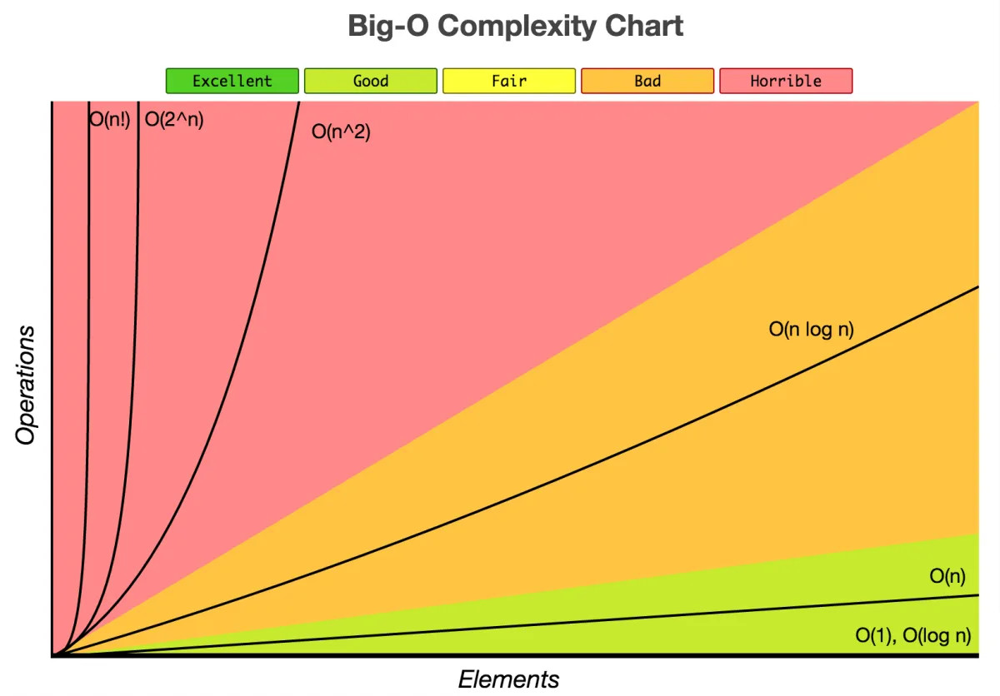

# Le tri par sélection

Le **tri par sélection** (du **minimum** ou du **maximum**) est un algorithme de tri par **comparaisons**.  
Il s'agit d'un algorithme simple mais qui est, comme on le verra, **inefficace**.

## Présentation du tri

### Avec un jeu de cartes

Pour comprendre le fonctionnement de ce tri, voici une petite activité à réaliser avec un **jeu de cartes** traditionnel.

On souhaite trier **une suite de 7 cartes** arbitrairement choisies.  
Par exemple :

On ne se souciera ici que des **valeurs** des cartes et non de leurs **couleurs**.  
Voici l'**ordre** des valeurs des cartes, de la **moins forte** à la **plus forte**, que l'on utilisera :

*Note* : Si la carte *Joker* existe dans votre jeu, on considèrera qu'elle est plus forte que toutes les autres cartes.

!!! abstract "Principe du tri par sélection"
    Le principe du **tri par sélection** du **minimum** est le suivant :

    1. Chercher l'**indice** de la **plus faible carte** de la suite (à partir de l'indice **0**) et **échanger** cette carte avec celle qui est placée en **premier**. La première carte est maintenant **la plus faible**.
    2. Chercher l'**indice** de la **plus faible carte** de la suite en partant du **2ème élément** (indice **1**) et **échanger** cette carte avec celle qui est placée en **deuxième**. Les **deux premières cartes** sont les plus faibles et sont maintenant **triées**.
    3. Poursuivre ainsi jusqu’à l’**avant dernière carte** de la suite.

<figure markdown>
  
  <figcaption>Exemple de déroulement du tri par sélection</figcaption>
</figure>

### Simulation avec des barres

Voici une simulation du **tri par sélection** en utilisant des barres de différentes tailles comme éléments.  
Le but est de trier les barres de la **plus petite** à **la plus grande**.

!!! success "Simulation du tri par sélection du minimum"
    

        <button id="run-button" class="md-button">Exécuter</button>
        <button id="reinit-button" class="md-button">Réinitialiser</button>
        <button id="speed-up-button" class="md-button">Accélérer</button>
        <button id="speed-down-button" class="md-button">Ralentir</button>
    

    

## L'algorithme

L'algorithme du **tri par sélection** peut être écrit de plusieurs manières différentes :

- en **itératif** ou en **récursif**,
- **en place** ou non.

!!! info "Tri en place"
    Un tri est dit *en place* s'il modifie directement la structure qu’il est en train de trier, plutôt que de créer et de renvoyer une nouvelle structure.

L'algorithme présenté ici sera écrit de manière **itérative** et **en place**.  
Le tri s'effectuera par sélection **du minimum**.

Pour simplifier les choses, on commence par séparer l'algorithme de tri en **3 sous-algorithmes** :

- l'algorithme principal `tri_selection(tableau)` permettant de trier un **tableau d'éléments** avec le **tri par sélection**,
- l'algorithme `minimum(tableau, debut)` permettant la recherche de l'indice de l'**élément minimal** du tableau à partir de l'indice `debut` donné,
- l'algorithme `echanger(tableau, i, j)` permettant d'échanger **deux éléments** d'indices `i` et `j` donnés.

!!! abstract "Algorithme du tri par sélection"
    **ALGORITHME** : tri_selection  
    **ENTRÉES** :  
    &nbsp;&nbsp;&nbsp;&nbsp;`tableau` : un **tableau** d'éléments pouvant être **comparés**  
    **SORTIE** : aucune (tri *en place*)

    **DÉBUT**  
    &emsp;&emsp;n ← longueur(tableau)  
    &emsp;&emsp;**POUR** debut **ALLANT DE** 0 **À** n - 2  
    &emsp;&emsp;&emsp;&emsp;indice_min ← minimum(tableau, debut)  
    &emsp;&emsp;&emsp;&emsp;**SI** indice_min **≠** debut, **ALORS**  
    &emsp;&emsp;&emsp;&emsp;&emsp;&emsp;echanger(tableau, debut, indice_min)  
    &emsp;&emsp;**FIN POUR**   
    &emsp;&emsp;Renvoyer **∅**  
    **FIN ALGORITHME**

!!! abstract "Algorithme de recherche du minimum"
    **ALGORITHME** : minimum  
    **ENTRÉES** :  
    &nbsp;&nbsp;&nbsp;&nbsp;`tableau` : un **tableau** d'éléments  
    &nbsp;&nbsp;&nbsp;&nbsp;`debut` : l'**indice** à partir duquel effectuer la recherche  
    **SORTIE** : l'**indice** de l'élément minimal dans l'intervalle `[debut, longueur(tableau) - 1]` du tableau

    **DÉBUT**  
    &emsp;&emsp;indice_min ← debut  
    &emsp;&emsp;**POUR** i **ALLANT DE** debut + 1 **À** longueur(tableau) - 1  
    &emsp;&emsp;&emsp;**SI** tableau[i] < tableau[indice_min], **ALORS**  
    &emsp;&emsp;&emsp;&emsp;indice_min ← i  
    &emsp;&emsp;**FIN POUR**  
    &emsp;&emsp;Renvoyer indice_min  
    **FIN ALGORITHME**

!!! abstract "Algorithme d'échange d'éléments"
    **ALGORITHME** : echanger  
    **ENTRÉES** :  
    &nbsp;&nbsp;&nbsp;&nbsp;`tableau` : un **tableau** d'éléments  
    &nbsp;&nbsp;&nbsp;&nbsp;`i` : l'**indice** d'un élément du tableau  
    &nbsp;&nbsp;&nbsp;&nbsp;`j` : l'**indice** d'un autre élément du tableau  
    **SORTIE** : aucune (tri en place)

    **DÉBUT**  
    &emsp;&emsp;temp ← tableau[i]  
    &emsp;&emsp;tableau[i] ← tableau[j]  
    &emsp;&emsp;tableau[j] ← temp  
    &emsp;&emsp;Renvoyer **∅**  
    **FIN ALGORITHME**

Voici enfin une version en **un seul** algorithme :

!!! abstract "Algorithme du tri par sélection"
    **ALGORITHME** : tri_selection  
    **ENTRÉES** :  
    &nbsp;&nbsp;&nbsp;&nbsp;`tableau` : un **tableau** d'éléments pouvant être **comparés**.  
    **SORTIE** : aucune (tri *en place*)

    **DÉBUT**  
    &emsp;&emsp;n ← longueur(tableau)  
    &emsp;&emsp;**POUR** debut **ALLANT DE** 0 **À** n - 2  
    &emsp;&emsp;&emsp;&emsp;indice_min ← debut  
    &emsp;&emsp;&emsp;&emsp;**POUR** i **ALLANT DE** debut + 1 **À** n - 1  
    &emsp;&emsp;&emsp;&emsp;&emsp;&emsp;**SI** tableau[i] < tableau[indice_min], **ALORS**  
    &emsp;&emsp;&emsp;&emsp;&emsp;&emsp;&emsp;&emsp;indice_min ← i  
    &emsp;&emsp;&emsp;&emsp;**FIN POUR**  
    &emsp;&emsp;&emsp;&emsp;**SI** indice_min ≠ debut, **ALORS**  
    &emsp;&emsp;&emsp;&emsp;&emsp;&emsp;temp ← tableau[debut]  
    &emsp;&emsp;&emsp;&emsp;&emsp;&emsp;tableau[debut] ← tableau[indice_min]  
    &emsp;&emsp;&emsp;&emsp;&emsp;&emsp;tableau[indice_min] ← temp  
    &emsp;&emsp;**FIN POUR**   
    &emsp;&emsp;Renvoyer **∅**  
    **FIN ALGORITHME**

!!! note "Notes"
    - La première boucle **POUR** s'arrête à `n - 2` car si tous les éléments de l'intervalle `[0, longueur(tableau) - 2]` sont **triés**, l'élément d'**indice** `longueur(tableau) - 1` est obligatoirement déjà à la **bonne position**.
    - La condition `SI indice_min ≠ i, ALORS` permet d'éviter d'effectuer une permutation si l'élément d'indice `i` correspond à l'élément **minimal**.

!!! note "Stabilité du tri"
    Un **tri** est dit **stable** s'il préserve l’**ordonnancement initial des éléments** que l'ordre considère comme égaux.  
    Le tri par sélection est, dans le cas de notre algorithme, **instable** car en cas de valeurs identiques dans le tableau initial, leur ordre relatif peut être modifié.

    *Exemple* : Avec le tableau `[2, 4a, 4b, 3, 7, 5]`, l'ordre des éléments de valeur `4` n'est pas conservé.

!!! note "Sélection du maximum"
    Si l'on souhait écrire cet algorithme en sélectionnant le **maximum** plutôt que le minimum, le principe serait le même, mais le parcours s'effectuerait du **dernier élément** au **premier élément** du tableau. Le tableau serait dans ce cas d'abord composé de la **partie non triée**, puis de la **partie triée**.

!!! note "À vous de jouer"
    **Question 1** : Déroulez le **tri par sélection** du minimum sur le tableau `[7, 1, 5, 3, 8, 5]` en vous aidant du tableau suivant :

    
    
    **Question 2** : Faites de même sur le tableau `[5, 3, 1, 4, 6, 2]`.

    **Question 3** : Même chose cette fois avec le tableau `['b', 'e', 'c', 'w', 'p', 'q']`. On utilisera l'ordre **lexicographique**.

## Implémentation du tri par sélection

On va maintenant implémenter l'algorithme du **tri par sélection** en **Python**.  
Les **tableaux** seront représentés par des **listes Python** (objets de type `list`).

!!! note "Question préliminaire"
    Les **listes Python** sont-elles des structures de données **mutables** ou non ?
    Citer 2 structures **mutables** et deux structures **non-mutables** en Python.

*Note* : Pour simplifier, on parlera de *tableaux triés* pour parler de *tableaux triés dans l'ordre croissant*.

!!! success "À télécharger"
    Récupérer le fichier [tri_selection.py](src/tri_selection.py) à compléter.

!!! note "Question 1"
    1. Compléter les fonctions : 
        - `minimum(tableau, debut)` : renvoie l'**indice** de l'élément de **valeur minimale** dans l'intervalle `[debut, len(tableau) - 1]`.
        - `echanger(tableau, i, j)` : échange les éléments d'indices `i` et `j` du tableau `tableau`.
    2. Compléter la fonction `tri_selection(tableau)` qui effectue le **tri par sélection** des éléments d'un tableau `tableau` donné, en réutilisant les deux fonctions précédentes.
    3. Est-il nécessaire de mettre un `return None` ? Pourquoi ?
    4. Peut-on dire que la fonction `tri_selection` est une **procédure** ? Pourquoi ?

!!! tip "Tester ma fonction"
    Le programme est muni de **tests** (lignes `12` à `21`) exécutés par le module *Doctest*.  
    Vous pouvez donc **tester vos fonctions** en exécutant simplement le programme. Si rien ne se passe, c'est que tout est bon. Sinon, l'interpréteur indiquera les tests qui ont échoué.

    (Vous pouvez rajouter d'autres tests ou effectuer des tests sur l'interpréteur si vous le souhaitez.)

!!! note "Question 2"
    Compléter la fonction `tri_selection_tout_en_un(tableau)` en ré-écrivant le **tri par sélection** sans appeler d'autres fonctions (les **recherches du minimum** et les **échanges** sont effectués **directement dans cette fonction**).

!!! note "Question 3"
    Écrire la fonction `tri_selection_decroissant(tableau)` qui effectue le **tri par sélection** des éléments d'un tableau dans l'**ordre décroissant**.

!!! note "Question 4"
    Dans les **tests**, à la ligne `18`, on trouve l'instruction `l = [randint(0, 100) for _ in range(20)]`.  
    Que fait cette instruction ? Quel est le nom de la **méthode** de **création de liste** utilisée ?

## Coût du tri par sélection

Voyons à présent quel est le **coût** du **tri par sélection**.  
On rappelle l'algorithme du **tri par sélection** et de **recherche du minimum** :

!!! abstract "Algorithme du tri par sélection"
    **ALGORITHME** : tri_selection  
    **ENTRÉES** :  
    &nbsp;&nbsp;&nbsp;&nbsp;`tableau` : un **tableau** d'éléments pouvant être **comparés**  
    **SORTIE** : aucune (tri *en place*)

    **DÉBUT**  
    &emsp;&emsp;n ← longueur(tableau)  
    &emsp;&emsp;**POUR** debut **ALLANT DE** 0 **À** n - 2  
    &emsp;&emsp;&emsp;&emsp;indice_min ← minimum(tableau, debut)  
    &emsp;&emsp;&emsp;&emsp;**SI** indice_min **≠** debut, **ALORS**  
    &emsp;&emsp;&emsp;&emsp;&emsp;&emsp;echanger(tableau, debut, indice_min)  
    &emsp;&emsp;**FIN POUR**   
    &emsp;&emsp;Renvoyer **∅**  
    **FIN ALGORITHME**

!!! abstract "Algorithme de recherche du minimum"
    **ALGORITHME** : minimum  
    **ENTRÉES** :  
    &nbsp;&nbsp;&nbsp;&nbsp;`tableau` : un **tableau** d'éléments  
    &nbsp;&nbsp;&nbsp;&nbsp;`debut` : l'**indice** à partir duquel effectuer la recherche  
    **SORTIE** : l'**indice** de l'élément minimal dans l'intervalle `[debut, longueur(tableau) - 1]` du tableau

    **DÉBUT**  
    &emsp;&emsp;indice_min ← debut  
    &emsp;&emsp;**POUR** i **ALLANT DE** debut + 1 **À** longueur(tableau) - 1  
    &emsp;&emsp;&emsp;**SI** tableau[i] < tableau[indice_min], **ALORS**  
    &emsp;&emsp;&emsp;&emsp;indice_min ← i  
    &emsp;&emsp;**FIN POUR**  
    &emsp;&emsp;Renvoyer indice_min  
    **FIN ALGORITHME**

!!! note "Question 1"
    On souhaite calculer le **nombre de comparaisons** effectué pour **trier** la liste `[3, 7, 1, 6, 5, 2]`.

    **Compléter** le tableau suivant en indiquant le **nombre de comparaisons** effectué après chaque **itération** de la **boucle principale** `POUR debut ALLANT DE 0 À n - 2`, c'est-à-dire le nombre de comparaisons effectué par l'algorithme `minimum(tableau, debut)` pour chaque valeur de `debut` de `0` à `n`, `n` étant la **longueur du tableau**.

    | itération k = | `debut` | tableau après itération k | nombre de comparaisons |
    | ------------- | ------- | ------------------------- | ---------------------- |
    | 1             | 0       | [1, **7, 3, 6, 5, 2**]    | ...                    |
    | 2             | 1       | [3, 2, **1, 6, 5, 7**]    | ...                    |
    | 3             | 2       | [3, 7, 1, **6, 5, 2**]    | ...                    |
    | 4             | 3       | [3, 7, 1, 2, **5, 6**]    | ...                    |
    | 5             | 4       | [3, 7, 1, 6, 5, **6**]    | ...                    |

    Calculer le nombre de comparaisons **au total**, noté $C(6)$, effectué pour trier ce tableau.

!!! note "Question 2"
    Si l'on change les valeurs du tableau de la question précédente, le **nombre de comparaisons** change t-il ? Pourquoi ?

!!! note "Question 3"
    Calculer le **nombre de comparaisons**, noté $C(n)$, pour un tableau de taille $n$.  
    Finalement, quelle est la **complexité** du **tri par sélection** ? (Voir l'aide ci-dessous si nécessaire.)

!!! tip "Rappel sur les complexités"
    Voici un rappel sur les différentes complexités :
    
    - Logarithmique $Θ(log~n)$ : la complexité évolue **moins vite** que le nombre **n** de données (par exemple : si on multiplie le nombre de données **n** par **2**, on ne rajoute qu'**une seule** opération).
    - Linéaire $Θ(n)$ : la complexité évolue **comme** le nombre **n** de données (par exemple : si on multiplie le nombre de données **n** par **2**, le temps d'exécution est multiplié par **2**).
    - Quasi-linéaire $O(n~log~n)$ : Intermédiaire entre linéaire et quadratique. En pratique, un algorithme de complexité quasi-linéaire a un comportement très proche d’un algorithme de complexité linéaire.
    - Quadratique $Θ(n^2)$ : la complexité évolue **comme le carré** du nombre **n** de données (par exemple : si on multiplie le nombres de données **n** par **2**, le temps d'exécution est multiplié par **4**).
    - Exponentielle $Θ(2^n)$ : la complexité évolue à terme **beaucoup plus vite** que n'importe quelle fonction polynomiale du nombre **n** de données (par exemple : si on multiplie le nombre de données **n** par **100**, le temps d'exécution est multiplié par $2^{100}$, soit **1267650600228229401496703205376**).

    <figure markdown>
    

    { width="80%" }
    <figcaption>Source : <https://buzut.net/cours/computer-science/time-complexity></figcaption>
    

    </figure>

!!! success "À télécharger"
    Récupérer le fichier [analyse_tri_selection.py](src/analyse_tri_selection.py).
    
    Ce fichier permet de **compter le nombre de comparaisons** effectué par le **tri par sélection**, en utilisant une **variable globale** `CNT` incrémentée à chaque comparaison de deux éléments effectuée.

    Vous pouvez modifier l'instruction à la ligne `38` en changeant le tableau pour lequel vous souhaitez compter le nombre de comparaisons.

## Terminaison du tri par sélection

!!! tip "Variant de boucle"
    Un **variant de boucle** est un **entier naturel** qui **décroit strictement** à chaque tour de boucle.  
    On exhibe un **variant de boucle** pour démontrer qu'une boucle **se termine**, en un temps fini.

à suivre...

## Preuve de correction du tri par sélection

à venir...